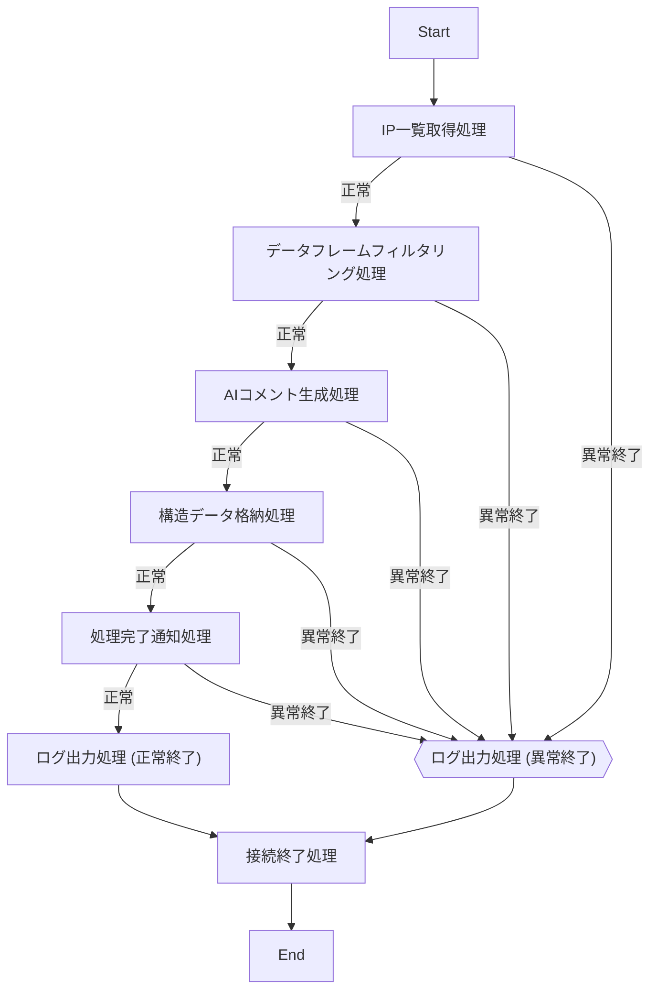

```mermaid
graph TD
    Start --> A["IP一覧取得処理"]
    A -- 正常 --> B["データフレームフィルタリング処理"]
    A -- 異常終了 --> G{{"ログ出力処理 (異常終了)"}}
    B -- 正常 --> C["AIコメント生成処理"]
    B -- 異常終了 --> G
    C -- 正常 --> D["構造データ格納処理"]
    C -- 異常終了 --> G
    D -- 正常 --> E["処理完了通知処理"]
    D -- 異常終了 --> G
    E -- 正常 --> F["ログ出力処理 (正常終了)"]
    E -- 異常終了 --> G
    F --> H["接続終了処理"]
    G --> H
    H --> End
    classDef diamond diamond-node stroke:#333,stroke-width:2px
    class G diamond-node
```
