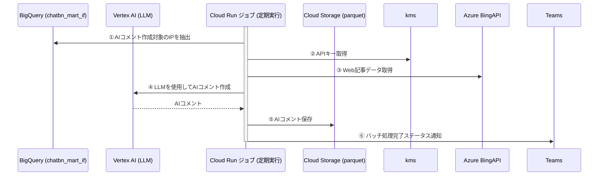

### bigquery型
テーブル名	キー
./src/infra.../type.py --------------------------------------
recent_aggregates	ip_id
recent_aggregates	recent_aggregate_date

```python
class RecentAggregates(TypedDict):
    ip_id: str
    recent_aggregate_date: str
```

./src/infra.../type.py --------------------------------------
ips_v	ip_id
ips_v	ip_name

```python

class IpsV(TypedDict):
    ip_id: str
    ip_name: str
```

./src/infra.../type.py --------------------------------------
trn_twitter_keyphrase_v	search_id, 
trn_twitter_keyphrase_v	keyphrase, 
trn_twitter_keyphrase_v	document_cnt, 
trn_twitter_keyphrase_v	yearmonthday, 

```python
class TrnTwitterKeyphraseV(TypedDict):
    search_id: str
    keyphrase: str
    document_cnt: int
    yearmonthday: str
```

./src/infra.../type.py --------------------------------------
trn_twitter_count_v	search_id, 
trn_twitter_count_v	aggregate_dtms
trn_twitter_count_v	document_cnt

```python
class TrnTwitterCountVType(TypedDict):
    search_id: str
    aggregate_dtms: str
    document_cnt: int
```

### vertex_ai型

./src/infra.../type.py --------------------------------------
# これはgemini型に従う

### parquet型
テーブル名	キー
./src/infra.../type.py --------------------------------------
ai_comment	ip_id
ai_comment	aggregate_date
ai_comment	keyword
ai_comment	count
ai_comment	url
ai_comment	title
ai_comment	comment
ai_comment	created_at

```python
from typing import TypedDict
from datetime import datetime
from typing import Optional

class AICommentType(TypedDict):
    ip_id: str
    aggregate_date: str
    keyword: str
    count: int
    url: str
    title: str
    comment: str
    created_at: str

def validate_ai_comment(comment: AICommentType) -> Optional[str]:
    """
    AICommentTypeのバリデーションを行う

    Args:
        comment (AICommentType): バリデーション対象のAIコメント

    Returns:
        Optional[str]: エラーメッセージ（バリデーション成功時はNone）
    """
    # ip_idのバリデーション
    if not comment["ip_id"] or not isinstance(comment["ip_id"], str):
        return "ip_idは必須で文字列である必要があります"

    # aggregate_dateのバリデーション（YYYY-MM-DD形式）
    try:
        datetime.strptime(comment["aggregate_date"], "%Y-%m-%d")
    except ValueError:
        return "aggregate_dateはYYYY-MM-DD形式である必要があります"

    # countのバリデーション（正の整数）
    if not isinstance(comment["count"], int) or comment["count"] < 0:
        return "countは正の整数である必要があります"

    # created_atのバリデーション（ISO 8601形式）
    try:
        datetime.fromisoformat(comment["created_at"])
    except ValueError:
        return "created_atはISO 8601形式である必要があります"

    # その他のフィールドのバリデーション
    if not comment["keyword"] or not isinstance(comment["keyword"], str):
        return "keywordは必須で文字列である必要があります"
    if not comment["url"] or not isinstance(comment["url"], str):
        return "urlは必須で文字列である必要があります"
    if not comment["title"] or not isinstance(comment["title"], str):
        return "titleは必須で文字列である必要があります"
    if not comment["comment"] or not isinstance(comment["comment"], str):
        return "commentは必須で文字列である必要があります"

    # バリデーション成功
    return None

# 使用例
comment: AICommentType = {
    "ip_id": "12345",
    "aggregate_date": "2023-10-01",
    "keyword": "AI",
    "count": 10,
    "url": "https://example.com",
    "title": "AIの未来",
    "comment": "AIは今後も発展するでしょう",
    "created_at": "2023-10-01T12:34:56Z"
}

validation_error = validate_ai_comment(comment)
if validation_error:
    print(f"バリデーションエラー: {validation_error}")
else:
    print("バリデーション成功")
```


### kms型

```python
project_id = "your-project-id"
secret_id = "your-secret-id"
azure_api_key = access_secret_version(project_id, secret_id)
print(f"Secret Value: {azure_api_key}")

from google.cloud import secretmanager

def access_secret_version(project_id: str, secret_id: str, version_id: str = "latest") -> str:
    """
    Secret Managerからシークレット値を取得する

    Args:
        project_id (str): GCPプロジェクトID
        secret_id (str): シークレットのID
        version_id (str): シークレットのバージョン（デフォルトは"latest"）

    Returns:
        str: シークレットの値
    """
    # Secret Managerクライアントを作成
    client = secretmanager.SecretManagerServiceClient()

    # シークレットのリソース名を構築
    name = f"projects/{project_id}/secrets/{secret_id}/versions/{version_id}"

    # シークレットのバージョンにアクセス
    response = client.access_secret_version(request={"name": name})

    # シークレットのペイロードを返す
    return response.payload.data.decode("UTF-8")

# 使用例
```

#### 説明
1. **`google-cloud-secret-manager`ライブラリ**: Secret Managerにアクセスするための公式ライブラリです。
2. **`access_secret_version`関数**: 
   - `project_id`: GCPプロジェクトIDを指定します。
   - `secret_id`: シークレットのIDを指定します。
   - `version_id`: シークレットのバージョンを指定します。デフォルトは`"latest"`で、最新バージョンを取得します。
3. **シークレットのリソース名**: `projects/{project_id}/secrets/{secret_id}/versions/{version_id}`の形式で指定します。
4. **`response.payload.data.decode("UTF-8")`**: シークレットの値をUTF-8でデコードして返します。

#### 必要な設定
- **IAM権限**: Secret Managerにアクセスするサービスアカウントに`roles/secretmanager.secretAccessor`ロールを付与する必要があります。
- **依存ライブラリ**: `google-cloud-secret-manager`をインストールします。
  ```bash
  pip install google-cloud-secret-manager
  ```

このコードをCloud RunやCloud Functionにデプロイして使用できます。

