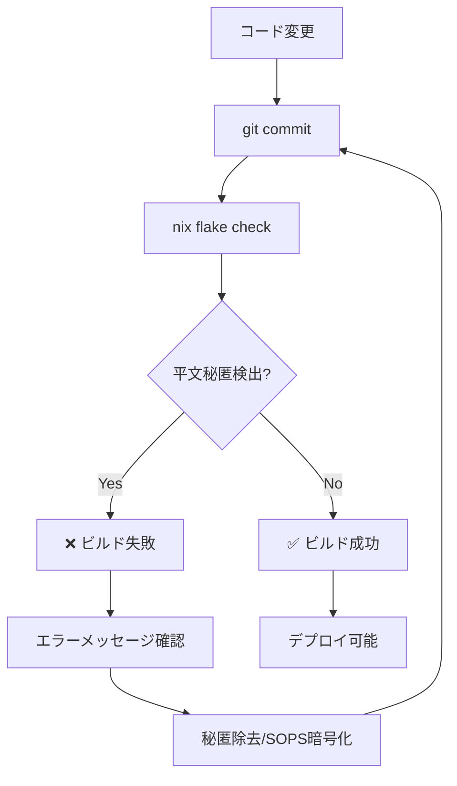

# RedwoodSDK R2 Security Policy

## Plaintext Secret Detection System

### 概要

本システムでは、平文秘匿情報の誤コミットを防ぐため、CI/CDパイプライン内で自動検知システムを実装しています。

### 検知対象パターン

以下の正規表現パターンで平文秘匿を検出します：

```regex
AKIA[A-Z0-9]{16}             # AWS Access Key ID
sk_live_[a-zA-Z0-9]{24,}     # Stripe Live Secret Key
pk_live_[a-zA-Z0-9]{24,}     # Stripe Live Publishable Key
sk_test_[a-zA-Z0-9]{24,}     # Stripe Test Secret Key
pk_test_[a-zA-Z0-9]{24,}     # Stripe Test Publishable Key
```

### CI失敗動作

平文秘匿が検出された場合、以下の動作を実行します：

1. **ビルド失敗**: `nix flake check`が非ゼロ終了コードで失敗
2. **詳細報告**: 検出されたファイルと内容を明示
3. **対処法提示**: 具体的な修正手順を表示

### 実行コマンド

```bash
# 手動実行
nix build .#checks.x86_64-linux.no-plaintext-secrets

# 全チェック実行
nix flake check
```

### 対処法

秘匿情報が検出された場合の推奨対処法：

#### 1. 即座の対応
```bash
# 平文秘匿をファイルから削除
git rm <detected-file>

# またはファイル内容を編集
# ファイルを開いて秘匿情報を除去
```

#### 2. SOPS暗号化への移行
```bash
# 秘匿設定の暗号化
just secrets-edit

# 暗号化されたファイルに機密情報を記載
# 例: secrets/r2.yaml
```

#### 3. .gitignore 追加
```bash
# 一時ファイルや設定ファイルの除外
echo "*.key" >> .gitignore
echo "*.secret" >> .gitignore
echo ".env.local" >> .gitignore
```

### 除外ディレクトリ

以下のディレクトリは検索対象外です：

- `.git/` - Git内部ファイル
- `result/` - Nixビルド結果
- `nix/` - Nix関連ファイル

### セキュリティレベル分類

#### 🔴 Critical (即座停止)
- 本番環境の実際のAPI鍵
- 実際のクレデンシャル情報

#### 🟡 Warning (要注意)
- テスト環境鍵
- ダミーまたは例示用鍵

#### 🟢 Safe (許可)
- ドキュメント内の環境変数名参照
- 設定例のプレースホルダー

### 改善推奨事項

#### 短期改善 (完了済み)
- ✅ 実際のCI失敗動作の実装
- ✅ 詳細なエラーメッセージの追加
- ✅ より厳密な正規表現パターンの採用

#### 中期改善 (推奨)
- 🔄 追加パターンの実装:
  - GitHub Personal Access Tokens (`ghp_[a-zA-Z0-9]{36}`)
  - OpenAI API Keys (`sk-[a-zA-Z0-9]{48}`)
  - JWT トークン検出

- 🔄 ホワイトリスト機能:
  - `.security-whitelist.yaml` での除外設定
  - ファイル別・行別の除外指定

#### 長期改善 (検討)
- 🔄 エントロピー分析による未知パターン検出
- 🔄 外部サービスとの連携（GitGuardian、TruffleHog等）
- 🔄 プレコミットフック統合

### 運用フロー



### 緊急時対応

既に秘匿情報がコミットされてしまった場合：

```bash
# 1. 秘匿情報の無効化
# 該当のAPIキーを無効化（プロバイダー側で実施）

# 2. Gitヒストリからの除去
git filter-branch --force --index-filter \
  'git rm --cached --ignore-unmatch <secret-file>' \
  --prune-empty --tag-name-filter cat -- --all

# 3. 強制プッシュ
git push --force --all

# 4. 新しい秘匿情報の生成・暗号化
just secrets-edit
```

### 定期レビュー

- 📅 **月次**: パターン有効性の確認
- 📅 **四半期**: 新しい秘匿パターンの追加検討
- 📅 **年次**: セキュリティポリシー全体の見直し

---

**重要**: このシステムは防御の第一線であり、開発者の意識的なセキュリティ実践と組み合わせて使用する必要があります。