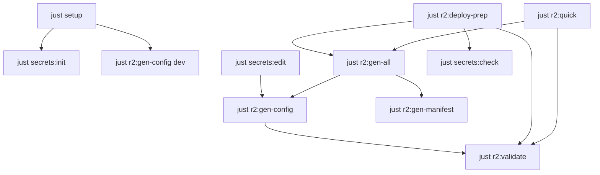

# 📋 Command Reference

Complete reference for all available commands in the R2 Connection Management System.

## 🚀 Core Commands

### `just help`
Show comprehensive help with all available commands and examples.

```bash
just help
```

### `just setup`
Complete R2 setup including secrets initialization and basic configuration.

```bash
just setup
```

**What it does:**
- Initializes encrypted secrets (`just secrets:init`)
- Generates default configuration for dev environment
- Creates basic wrangler.jsonc

### `just status`
Show overall R2 configuration status.

```bash
just status
```

**Output includes:**
- Age key status
- SOPS configuration status
- R2 secrets status
- wrangler.jsonc status
- Generated files status

### `just clean`
Clean generated files and backups with confirmation prompt.

```bash
just clean
```

**Removes:**
- `generated/` directory
- `wrangler.jsonc`
- Backup files (`wrangler.jsonc.backup.*`)

## 🔐 Secret Management Commands

### `just secrets:init`
Initialize SOPS encryption with Age.

```bash
just secrets:init
```

**Creates:**
- Age key pair in `~/.config/sops/age/keys.txt`
- SOPS configuration in `.sops.yaml`

### `just secrets:edit [FILE]`
Edit encrypted secrets securely.

```bash
# Edit default R2 secrets
just secrets:edit

# Edit specific file
just secrets:edit secrets/r2-prod.yaml
```

**Default file:** `secrets/r2.yaml`

### `just secrets:check`
Validate that no plaintext secrets are present.

```bash
just secrets:check
```

**Scans for:**
- AWS access keys
- API tokens
- Other credential patterns

## 🔧 R2 Configuration Commands

### `just r2:gen-config [ENV]`
Generate wrangler.jsonc configuration for specified environment.

```bash
# Generate for default environment (dev)
just r2:gen-config

# Generate for production
just r2:gen-config prod

# Generate for staging
just r2:gen-config stg
```

**Output:** `wrangler.jsonc`

### `just r2:gen-manifest [ENV]`
Generate R2 connection manifest for external tools.

```bash
just r2:gen-manifest prod
```

**Output:** `generated/r2-connection-manifest-{ENV}.json`

### `just r2:gen-all [ENV]`
Generate all R2 configurations for an environment.

```bash
just r2:gen-all prod
```

**Equivalent to:**
```bash
just r2:gen-config prod
just r2:gen-manifest prod
```

### `just r2:validate [ENV]`
Validate R2 configuration for specified environment.

```bash
just r2:validate prod
```

**Validates:**
- Configuration schema
- Credential format
- Bucket naming conventions
- Security settings

## 🌍 Environment Management Commands

### `just r2:envs`
Discover and list available R2 environments.

```bash
just r2:envs
```

**Output:** List of configured environments with status

### `just r2:status [ENV]`
Show environment-specific status.

```bash
just r2:status prod
```

**Shows:**
- wrangler.jsonc status
- Connection manifest status
- R2 secrets status
- Current configuration details

### `just r2:list-configs`
List all generated configurations.

```bash
just r2:list-configs
```

**Shows:**
- Available connection manifests
- Wrangler configurations
- Backup files

## 🧪 Configuration Validation Commands

### `just r2:test [ENV]`
Validate R2 configuration for specified environment.

```bash
# Validate dev environment configuration
just r2:test dev

# Validate production environment configuration
just r2:test prod
```

**For all environments:**
- Performs configuration validation only
- Validates wrangler.jsonc schema and settings
- Validates connection manifest if present
- No actual R2 Control Plane operations

### `just r2:validate-all`
Validate all available environments.

```bash
just r2:validate-all
```

**Validates each discovered environment sequentially**

### `just r2:check-syntax`
Check TypeScript and JavaScript syntax.

```bash
just r2:check-syntax
```

**Equivalent to:** `nix flake check`

## 🔄 Development Workflow Commands

### `just r2:dev [ACTION] [ENV]`
Development workflow helper with multiple actions.

```bash
# Full development workflow (default)
just r2:dev full dev

# Generate configurations only
just r2:dev gen dev

# Validate configurations only
just r2:dev validate dev

# Validate only
just r2:dev test dev
```

**Available actions:**
- `gen` - Generate configurations
- `validate` - Validate configurations
- `test` - Run configuration validation
- `full` - Complete workflow (default)

### `just r2:quick [ENV]`
Quick setup: generate + validate for an environment.

```bash
just r2:quick dev
```

**Equivalent to:**
```bash
just r2:gen-all dev
just r2:validate dev
```

### `just r2:deploy-prep [ENV]`
Prepare environment for deployment validation.

```bash
just r2:deploy-prep prod
```

**Steps performed:**
1. Generate fresh configurations
2. Validate configurations
3. Check syntax and security
4. Display next steps

## 🏗️ Resource Management Commands

### `just res:inventory [ENV]`
Show Cloudflare resource inventory for specified environment.

```bash
just res:inventory prod
```

**Output:** Current resource state from Cloudflare API

### `just res:fetch-state [ENV]`
Fetch current remote state from Cloudflare.

```bash
just res:fetch-state prod
```

**Downloads:** Latest resource configurations from Cloudflare

### `just res:diff [ENV]`
Compare SOT configuration with remote state (drift detection).

```bash
just res:diff prod
```

**Output:**
- 0 = No drift (SOT matches remote)
- 1 = Drift detected (differences found)
- 2+ = Error (SOT/remote/comparison issues)

### `just cf:plan [ENV]`
Preview infrastructure changes (CI/CD safe).

```bash
just cf:plan prod
```

**Performs:** Pulumi preview operation without applying changes

### `just cf:apply [ENV]`
Apply infrastructure changes (manual only, drift detection required).

```bash
just cf:apply prod
```

**Prerequisites:**
- SOT configuration must exist
- Must run `just res:diff [ENV]` first to verify drift status
- Manual confirmation required

### `just cf:destroy [ENV]`
Destroy infrastructure resources (manual only, drift detection required).

```bash
just cf:destroy prod
```

**Prerequisites:**
- SOT configuration must exist
- Must run `just res:diff [ENV]` first to verify current state
- Manual confirmation required

## 🛠️ Advanced Tools Commands

### `just r2:backup-config`
Backup current wrangler.jsonc with timestamp.

```bash
just r2:backup-config
```

**Creates:** `wrangler.jsonc.backup.YYYYMMDD_HHMMSS`

### `just r2:restore-config [FILE]`
Restore wrangler.jsonc from backup file.

```bash
just r2:restore-config wrangler.jsonc.backup.20250101_120000
```

**Safety features:**
- Backs up current config before restore
- Validates backup file exists

### `just r2:diff-configs [ENV1] [ENV2]`
Compare R2 configurations between environments.

```bash
just r2:diff-configs dev prod
```

**Requirements:**
- Both environment manifests must exist
- Generates diff of connection manifests

## 📊 Monitoring & Debugging Commands

### `wrangler tail`
View live logs from deployed Worker (not part of justfile, but commonly used).

```bash
# View all logs
wrangler tail

# View with formatting
wrangler tail --format pretty

# Filter for errors only
wrangler tail --filter error

# Limit to recent logs
wrangler tail --lines 100
```

### `wrangler dev`
Start local development server (not part of justfile, but commonly used).

```bash
# Local development with Miniflare
wrangler dev --local

# Remote development with real R2
wrangler dev --remote

# Custom port
wrangler dev --local --port 8788
```

## 🔧 Command Options and Environment Variables

### Default Environment
Most commands accept an optional environment parameter:

```bash
# Default environment (defined in justfile)
DEFAULT_ENV := "dev"

# Override default
ENV=prod just r2:gen-config
```

### Global Environment Variable
Set environment for multiple commands:

```bash
export ENV=prod
just r2:gen-config    # Uses prod
just r2:validate      # Uses prod
just r2:deploy-prep   # Uses prod
```

### Command-Specific Options

**File specification:**
```bash
# Default file
just secrets:edit

# Specific file
just secrets:edit secrets/r2-staging.yaml
```

**Environment specification:**
```bash
# Using default environment
just r2:gen-config

# Explicit environment
just r2:gen-config prod

# Using environment variable
ENV=stg just r2:gen-config
```

## 🚨 Error Handling

### Common Error Messages

**"❌ Missing environment"**
```bash
# Solution: Specify environment
just r2:gen-config prod
```

**"❌ No secrets found"**
```bash
# Solution: Initialize and edit secrets
just secrets:init
just secrets:edit
```

**"❌ Configuration validation failed"**
```bash
# Solution: Check and fix configuration
just secrets:edit
just r2:validate dev
```

**"❌ Age key not found"**
```bash
# Solution: Initialize encryption
just secrets:init
```

### Debug Mode

Enable verbose output for troubleshooting:

```bash
# Enable debug for wrangler
export WRANGLER_LOG=debug

# Enable debug for R2 tests
export DEBUG=true
just r2:test dev
```

## 📋 Command Cheat Sheet

### Quick Development Setup
```bash
nix develop              # Enter development environment
just setup               # Initialize system
just r2:test dev         # Validate configuration
wrangler dev --local     # Start development server
```

### Environment Configuration
```bash
just secrets:edit secrets/r2-{env}.yaml  # Edit environment secrets
just r2:gen-all {env}                     # Generate all configs
just r2:validate {env}                    # Validate configuration
```

### Production Deployment
```bash
just r2:deploy-prep prod   # Prepare configuration for deployment
just res:diff prod         # Check for configuration drift
just cf:plan prod          # Preview infrastructure changes
just cf:apply prod         # Apply infrastructure changes
wrangler deploy            # Deploy application to Cloudflare
wrangler tail             # Monitor logs
```

### Troubleshooting
```bash
just status               # Check system status
just secrets:check       # Check for plaintext secrets
just r2:validate-all     # Validate all environments
just res:diff [env]      # Check for configuration drift
nix flake check          # Check Nix configuration
```

### Backup and Restore
```bash
just r2:backup-config                         # Backup current config
just r2:restore-config wrangler.jsonc.backup.* # Restore from backup
```

## 🔗 Command Relationships



## 📚 Related Documentation

- **[Local Development Guide](local-development.md)** - Using local commands effectively
- **[Production Setup Guide](production-setup.md)** - Production deployment commands
- **[Troubleshooting Guide](troubleshooting.md)** - When commands fail
- **[Security Guide](security-guide.md)** - Security-related commands