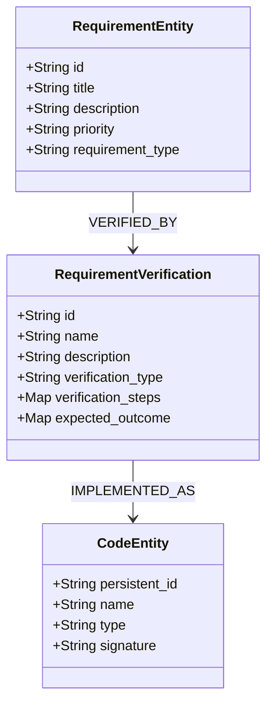

# 動く設計書としてのテストをモデリングする

「テストは動く設計書である」という概念を階層型トレーサビリティモデルに組み込むための段階的実装計画

## フェーズ0: RequirementVerification 基盤（最小限の構成）

| 要件ID | 要件内容 | 管理ノード | 管理プロパティ/関係 |
|--------|---------|-----------|-------------------|
| RV-1 | 要件と検証の基本的関連付け | RequirementVerification | verification_type, description |
| RV-2 | 検証手順の定義 | RequirementVerification | verification_steps |
| RV-3 | 期待結果の記述 | RequirementVerification | expected_outcome |
| RV-4 | RequirementEntityとの関連 | RequirementEntity→RequirementVerification | VERIFIED_BY関係 |
| RV-5 | CodeEntityとの関連 | RequirementVerification→CodeEntity | IMPLEMENTED_AS関係 |

## フェーズ1: 基本的な検証証拠（動く設計書の基盤）

| 要件ID | 要件内容 | 管理ノード | 管理プロパティ/関係 |
|--------|---------|-----------|-------------------|
| 15-a | 多次元検証結果 | VerificationEvidence | result_metrics, confidence, coverage |
| 16-a | 形式的な検証条件 | RequirementVerification | formal_conditions |
| 17-a | 変化の種類と影響の分類 | VerificationEvidence | change_type, impact_classification |
| 18-a | 観測値の基本統計 | ObservabilitySignal | basic_measurements, threshold_values |
| 19-a | 基本的なトレーサビリティ | 基本関係構造 | CodeEntity→VerificationEvidence→RequirementEntity |
| 22-a | 基本的な信頼度表現 | VerificationEvidence | trust_level |

## フェーズ2: 拡張検証機能（日常的利用）

| 要件ID | 要件内容 | 管理ノード | 管理プロパティ/関係 |
|--------|---------|-----------|-------------------|
| 16-d | 反例の詳細記録 | VerificationEvidence | counterexamples |
| 17-c | 不安定なテストの検出 | VerificationEvidence | stability_score, flakiness_factor |
| 18-c | 複合メトリクスの定義 | ObservabilitySignal | compound_metrics, calculation_formula |
| 21-a | 基本的な集計アルゴリズム | VerificationEvidence | aggregation_rules |
| 24-a | 反例の基本管理 | VerificationEvidence | categorized_examples |
| 25-a | 検証活動の基本コスト記録 | VerificationEvidence | time_cost, resource_usage |

## フェーズ3: 分析と履歴管理（意思決定支援）

| 要件ID | 要件内容 | 管理ノード | 管理プロパティ/関係 |
|--------|---------|-----------|-------------------|
| 16-c | 静的解析と動的テストの結果統合 | VerificationEvidence | combined_verification_results |
| 17-b | 検証状態遷移の理由 | VerificationHistory | transition_reason, related_changes |
| 20-a | 検証結果の傾向分析 | VerificationHistory | trend_analysis |
| 22-c | 証明レベルの時間変化 | VerificationHistory | proof_level_changes |
| 23-b | 検証の過不足の自動分析 | RequirementVerification | coverage_analysis, verification_gaps |
| 26-b | 類似要件に対する検証戦略推奨 | VerificationKnowledge | similarity_analysis, strategy_matching |

## フェーズ4: 高度分析と最適化（自動化）

| 要件ID | 要件内容 | 管理ノード | 管理プロパティ/関係 |
|--------|---------|-----------|-------------------|
| 17-d | 検証履歴からの予測分析 | VerificationAnalytics | prediction_models |
| 18-d | 異常検出アルゴリズム連携 | ObservabilitySignal | anomaly_detection_config |
| 19-c | 推論ルールを含むクエリ | クエリエンジン | inference_rules, impact_analysis_rules |
| 20-c | 将来的な検証状態の予測 | VerificationAnalytics | prediction_models, forecasting_data |
| 21-c | 要件間の依存関係を考慮した集計 | AggregationRule | dependency_aware_calculation |
| 22-d | 証明ギャップの特定と優先順位付け | VerificationGap | gap_location, priority_score |
| 23-c | 効果的な検証手法の自動推奨 | RequirementVerification | recommended_strategies |
| 25-c | 検証投資の最適配分支援 | VerificationROI | optimization_recommendations |

## フェーズ5: 組織的知識管理（成熟段階）

| 要件ID | 要件内容 | 管理ノード | 管理プロパティ/関係 |
|--------|---------|-----------|-------------------|
| 24-b | 過去の失敗パターンからの学習 | CounterexampleLibrary | failure_patterns, lessons_learned |
| 24-c | 反例の最小化と高度分類 | CounterexampleLibrary | minimization_results, categorization_scheme |
| 26-a | 検証パターンのカタログ化 | VerificationKnowledge | pattern_catalog, usage_examples |
| 26-c | 組織的な検証ノウハウの蓄積 | VerificationKnowledge | organizational_practices, knowledge_base |
