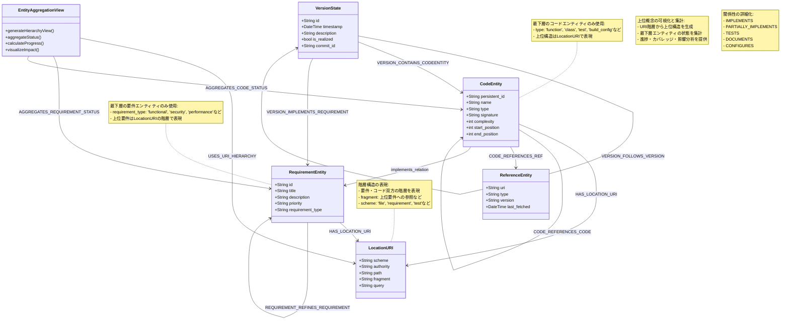

```mermaid
classDiagram
    class LocationURI {
        +String scheme
        +String authority
        +String path
        +String fragment
        +String query
    }
    
    class CodeEntity {
        +String persistent_id
        +String name
        +String type
        +String signature
        +int complexity
        +int start_position
        +int end_position
    }
    
    class RequirementEntity {
        +String id
        +String title
        +String description
        +String priority
        +String requirement_type
    }
    
    class VersionState {
        +String id
        +DateTime timestamp
        +String description
        +bool is_realized
        +String commit_id
    }
    
    class EntityAggregationView {
        +generateHierarchyView()
        +aggregateStatus()
        +calculateProgress()
        +visualizeImpact()
    }
    
    class ReferenceEntity {
        +String uri
        +String type
        +String version
        +DateTime last_fetched
    }
    
    CodeEntity --> LocationURI : HAS_LOCATION_URI
    CodeEntity --> CodeEntity : CODE_REFERENCES_CODE
    CodeEntity --> ReferenceEntity : CODE_REFERENCES_REF
    RequirementEntity --> LocationURI : HAS_LOCATION_URI
    RequirementEntity --> RequirementEntity : REQUIREMENT_DEPENDS_ON_REQUIREMENT
    RequirementEntity --> RequirementEntity : REQUIREMENT_REFINES_REQUIREMENT
    CodeEntity --> RequirementEntity : implements_relation
    
    VersionState --> VersionState : VERSION_FOLLOWS_VERSION
    VersionState --> CodeEntity : VERSION_CONTAINS_CODEENTITY
    VersionState --> RequirementEntity : VERSION_IMPLEMENTS_REQUIREMENT
    
    EntityAggregationView --> LocationURI : USES_URI_HIERARCHY
    EntityAggregationView --> RequirementEntity : AGGREGATES_REQUIREMENT_STATUS
    EntityAggregationView --> CodeEntity : AGGREGATES_CODE_STATUS
    
    note for CodeEntity "最下層のコードエンティティのみ使用:<br>- type: 'function', 'class', 'test', 'build_config'など<br>- 上位構造はLocationURIで表現"
    
    note for RequirementEntity "最下層の要件エンティティのみ使用:<br>- requirement_type: 'functional', 'security', 'performance'など<br>- 上位要件はLocationURIの階層で表現"
    
    note for ViewGenerator "上位概念の可視化と集計:<br>- URI階層から上位構造を生成<br>- 最下層エンティティの状態を集計<br>- 進捗・カバレッジ・影響分析を提供"
    
    note for LocationURI "階層構造の表現:<br>- 要件・コード双方の階層を表現<br>- fragment: 上位要件への参照など<br>- scheme: 'file', 'requirement', 'test'など"
    
    note for implements_relation "関係性の詳細化:<br>- IMPLEMENTS<br>- PARTIALLY_IMPLEMENTS<br>- TESTS<br>- DOCUMENTS<br>- CONFIGURES"
```