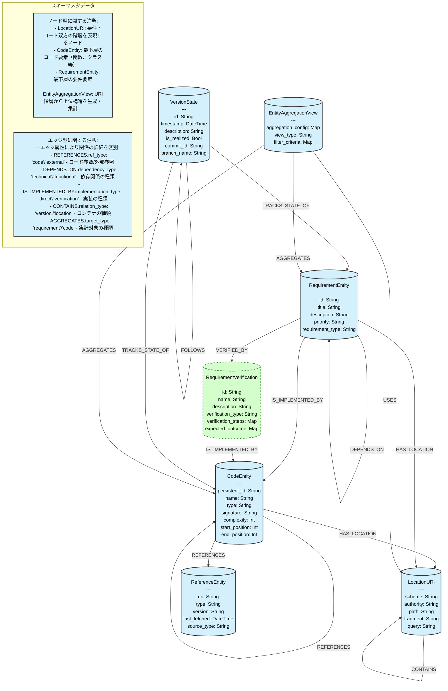

# 階層型トレーサビリティモデル スキーマ図

このドキュメントはトレーサビリティモデルのグラフデータベーススキーマを定義します。

## スキーマ説明

### ノード型

1. **CodeEntity**: コードの構成要素（関数、クラス、メソッドなど）を表すノード
   - 最下層のコードエンティティのみ使用
   - type属性により種類を区別（function, class, test, build_configなど）
   - 上位構造はLocationURIの階層で表現

2. **RequirementEntity**: システム要件を表すノード
   - 最下層の要件エンティティのみ使用
   - requirement_type属性により種類を区別（functional, security, performanceなど）
   - 上位要件はLocationURIの階層で表現

3. **LocationURI**: コードや要件の場所情報を保持するノード
   - 要件・コード双方の階層を表現
   - scheme属性: 'file', 'requirement', 'test'などに使用
   - fragment属性: 上位要件への参照などに使用
   - LocationURI間のCONTAINS関係で階層構造を表現

4. **VersionState**: バージョン管理情報を表すノード
   - branch_name属性: バージョンのブランチ情報（オプション）

5. **ReferenceEntity**: 外部参照情報を保持するノード
   - source_type属性: 参照ソースの種類を区別

6. **RequirementVerification**: 要件の検証方法を定義するノード（フェーズ0の拡張）

7. **EntityAggregationView**: URI階層から上位構造を生成し集計するためのノード
   - URI階層から上位構造を生成
   - 最下層エンティティの状態を集計
   - 進捗・カバレッジ・影響分析を提供

### エッジ型

#### 基本的な関係
- **HAS_LOCATION**: エンティティの位置情報を関連付ける
- **REFERENCES**: コード間の参照関係や外部参照への関係
  - ref_type属性で参照種別を区別（code/external）

#### 要件間の関係
- **DEPENDS_ON**: ある要件が別の要件に依存していることを表す関係
  - dependency_type属性で依存種別を区別（technical/functionalなど）

#### 実装関係
- **IS_IMPLEMENTED_BY**: 要件や検証のコードによる実装関係
  - implementation_type属性で実装種別を区別（direct/verificationなど）
- **VERIFIED_BY**: 要件と検証の関連付け

#### 階層関係
- **CONTAINS**: 親子関係を表すエッジ
  - relation_type属性で関係種別を区別（version/location）
  - LocationURI間のCONTAINS関係で要件とコードの階層構造を表現

#### バージョン関連
- **FOLLOWS**: バージョン間の順序関係
- **TRACKS_STATE_OF**: バージョンとエンティティ（コード/要件）の状態追跡関係

#### 集計ビュー関連
- **USES**: 集計ビューとURI階層の関連付け
- **AGGREGATES**: 状態の集計関係
  - target_type属性で集計対象を区別（requirement/code）

### 注意事項

- 要件とコードの階層構造はすべてLocationURIノードと、そのノード間のCONTAINS関係で表現します
- エッジ名は簡潔にし、詳細はエッジの属性で区別します
- 循環依存の検出には注意が必要です
