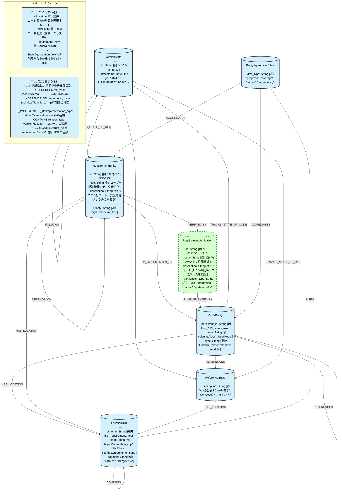

# 階層型トレーサビリティモデル スキーマ図

このドキュメントはトレーサビリティモデルのグラフデータベーススキーマを定義します。

## スキーマ説明

### ノード型

1. **CodeEntity**: コードの構成要素（関数、クラス、メソッドなど）を表すノード
   - 最下層のコードエンティティのみ使用
   - persistent_id属性: システム内で一意の識別子 [例: 'func_123', 'class_user']
   - name属性: 人間が読める名前 [例: 'calculateTotal', 'UserModel'] 
   - type属性: コードの種類 [選択: 'function', 'class', 'method', 'module', 'test', 'build_config']
   - start_position/end_position: ソースコード内の位置 [例: 120, 350]
   - 上位構造はLocationURIの階層で表現

2. **RequirementEntity**: コードが従うシステム要件を表すノード
   - 最下層の要件エンティティのみ使用
   - id属性: 要件の識別子 [例: 'REQ-001', 'SEC-123']
   - title属性: 要件の簡潔な説明 [例: 'ユーザー認証機能', 'データ暗号化']
   - description属性: 詳細な要件記述 [例: 'システムはユーザー認証を提供する必要がある']
   - priority属性: 優先度 [選択: 'high', 'medium', 'low']
   - 上位要件はLocationURIの階層で表現

3. **LocationURI**: コードや要件の場所情報を保持するノード
   - 要件・コード双方の階層を表現
   - scheme属性: 位置種別 [選択: 'file', 'requirement', 'test', 'document']
   - authority属性: 所有者/ホスト [例: 'github.com', 'local', 'gitlab']
   - path属性: 階層パス [例: '/src/auth/login.js', '/docs/requirements.md']
   - fragment属性: 詳細位置情報 [例: 'L10-L25', 'REQ-001-2']
   - LocationURI間のCONTAINS関係で階層構造を表現
   - システム全体での1:N関係の管理をLocationURIによるパス管理に全権委任
   - 規約やドキュメント参照も同様にLocationURIを介して管理する

4. **VersionState**: バージョン管理情報を表すノード
   - id属性: バージョン識別子 [例: 'v1.0.0', 'sprint-12'] 
   - timestamp属性: 作成日時 [例: '2024-12-31T23:59:59Z']
   - commit_id属性: VCSのコミットハッシュ [例: 'a1b2c3d4', '7890abcd']
   - branch_name属性: ブランチ名 [例: 'main', 'feature/auth']

5. **ReferenceEntity**: コードが参照する要件以外情報（規約やライブラリ公式ドキュメントなど）を保持するノード
   - type属性: 参照種別 [選択: 'api', 'library', 'document', 'dependency']
   - source_type属性: ソース種別 [選択: 'internal', 'external', 'third-party']
   - description属性: 参照の説明 [例: 'xxxの公式SDK/API参照', 'xxxの公式ドキュメント']
   - **注意**: uri/url属性は削除されました（DEPRECATED）- 外部参照先URLは別の方法で管理してください

6. **RequirementVerification**: 要件の検証方法を定義するノード（フェーズ0の拡張）
   - id属性: 検証の識別子 [例: 'TEST-001', 'VER-123']
   - name属性: 検証の名称 [例: 'ログインテスト', '性能検証']
   - description属性: 検証の詳細 [例: 'ユーザーログインの成功・失敗ケースを検証']
   - verification_type属性: 検証方法 [選択: 'unit-test', 'integration', 'manual', 'acceptance']

7. **EntityAggregationView**: URI階層から上位構造を生成し集計するためのノード
   - view_type属性: ビューの種類 [選択: 'progress', 'coverage', 'impact', 'dependency']
   - URI階層から上位構造を生成
   - 最下層エンティティの状態を集計
   - 進捗・カバレッジ・影響分析を提供

### エッジ型

#### 基本的な関係
- **HAS_LOCATION**: エンティティ（コード/要件/参照）の位置情報を関連付ける
- **REFERENCES_CODE**: コード間の参照関係
  - ref_type属性で参照種別を区別 [選択: 'import', 'call', 'extends']
- **REFERS_TO**: コードエンティティから外部参照への関係
  - ref_type属性で参照種別を区別 [選択: 'api', 'document', 'convention']

#### 要件間の関係
- **DEPENDS_ON**: ある要件が別の要件に依存していることを表す関係
  - dependency_type属性で依存種別を区別 [選択: 'technical', 'functional', 'security', 'performance']

#### 実装関係
- **IS_IMPLEMENTED_BY**: 要件や検証のコードによる実装関係
  - implementation_type属性で実装種別を区別 [選択: 'direct', 'verification', 'partial']
- **VERIFIED_BY**: 要件と検証の関連付け

#### 階層関係
- **CONTAINS**: 親子関係を表すエッジ
  - relation_type属性で関係種別を区別 [選択: 'version', 'location', 'scope']
  - LocationURI間のCONTAINS関係で要件とコードの階層構造を表現

#### バージョン関連
- **FOLLOWS**: バージョン間の順序関係
- **TRACKS_STATE_OF_CODE**: バージョンとコードエンティティの状態追跡関係
- **TRACKS_STATE_OF_REQ**: バージョンと要件エンティティの状態追跡関係
- **TRACKS_STATE_OF_REFERENCE**: バージョンと参照エンティティの状態追跡関係

#### 集計ビュー関連
- **USES**: 集計ビューとURI階層の関連付け
- **AGGREGATES**: 状態の集計関係
  - target_type属性で集計対象を区別 [選択: 'requirement', 'code', 'verification']
  - aggregation_method [選択: 'count', 'coverage', 'percentage', 'status']

### 注意事項

- 要件とコードの階層構造はすべてLocationURIノードと、そのノード間のCONTAINS関係で表現します
- エッジ名は簡潔にし、詳細はエッジの属性で区別します
- 循環依存の検出には注意が必要です
- **CodeEntityは実際にファイル（納品物）として残す実コードに限定して使用すること**
  - 規約の例示コードやドキュメントサンプルなどはCodeEntityとして格納してはならない
  - これらは参照情報としてReferenceEntityとして格納する
- **階層構造はエンティティではなく、LocationURIのパス表現で管理すること**
  - カテゴリ自体をエンティティとして扱わない
  - 実エンティティは最深ネスト（リーフ）のみに配置
  - URIのfragment部分で階層を表現（例: `file:///path/to/file#category0.category00.category000.value`）
  - これにより、データ冗長性を避け、階層変更の柔軟性を確保する
