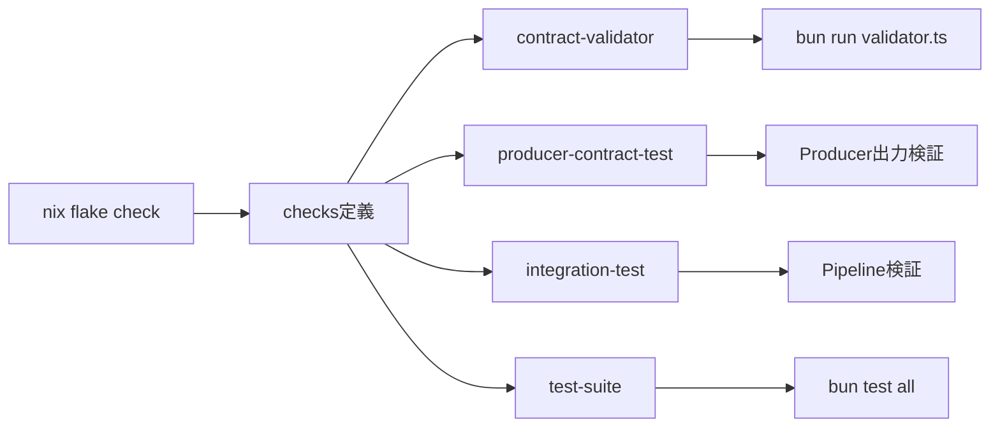

# 完成時のディレクトリ構造

## Tree構造

```
contract-flake/
├── flake.nix                    # Nix flake定義（checks含む）
├── flake.lock                   # 依存関係のロック
├── package.json                 # bun/npm依存関係
├── bun.lock                     # bunロックファイル
├── tsconfig.json               # TypeScript設定
├── README.md                   # プロジェクト説明
│
├── src/                        # ソースコード
│   ├── contracts/              # 契約定義
│   │   ├── command-contract.ts      # コマンドベース契約
│   │   ├── data-provider.contract.ts # プロバイダー契約
│   │   └── data-consumer.contract.ts # コンシューマー契約
│   │
│   ├── validator.ts            # 契約検証ロジック（旧minimal-glue）
│   │
│   └── types/                  # 型定義
│       └── flake-contract.ts   # 基本契約型
│
├── test/                       # テストファイル
│   ├── internal-test.ts        # bun内部テスト
│   └── internal-test.sh        # sh/jq代替テスト
│
├── examples/                   # 実装例
│   ├── command-producer/       # Producer実装例
│   │   ├── flake.nix          # Producer flake
│   │   └── flake.lock         
│   │
│   ├── command-consumer/       # Consumer実装例
│   │   ├── flake.nix          # Consumer flake
│   │   ├── consumer.ts        # TypeScript実装
│   │   └── flake.lock
│   │
│   ├── data-provider-flake/   # データプロバイダー例
│   │   └── flake.nix
│   │
│   └── data-consumer-flake/   # データコンシューマー例
│       └── flake.nix
│
├── docs/                       # ドキュメント
│   └── *.md                    # 各種説明文書
│
└── test-contract-validation.ts # 契約検証テストのエントリーポイント
```

## flake.nixのchecks構造

```nix
checks = {
  # 1. 契約検証ロジックのテスト
  contract-validator        # validator.tsの動作確認
  
  # 2. Producer実装の契約遵守テスト
  producer-contract-test    # Producerの出力が契約に準拠
  
  # 3. 統合テスト
  integration-test         # Producer→Consumerパイプライン
  
  # 4. フルテストスイート
  test-suite              # すべてのテストを実行
}
```

## テスト実行フロー



## コマンド例

```bash
# 開発環境に入る
nix develop

# すべてのチェックを実行
nix flake check

# 特定のチェックのみ実行
nix build .#checks.x86_64-linux.contract-validator
nix build .#checks.x86_64-linux.producer-contract-test
nix build .#checks.x86_64-linux.integration-test

# bunで直接テスト実行（開発時）
bun test test/internal-test.ts
bun run src/validator.ts

# Producer/Consumerの実行
nix run .#producer
nix run .#consumer
```

## 重要ファイルの責務

| ファイル | 責務 | 実行方法 |
|---------|------|----------|
| `flake.nix` | Nix環境定義、checks定義 | `nix flake check` |
| `src/validator.ts` | 契約検証ロジック | `bun run src/validator.ts` |
| `src/contracts/*.ts` | 契約定義（Zod） | import して使用 |
| `test/internal-test.ts` | 内部実装テスト | `bun test` |
| `examples/*/flake.nix` | 実装例のflake | `nix run` |

## 契約の流れ

```
1. 契約定義（src/contracts/）
      ↓
2. 実装作成（examples/*/）
      ↓
3. 契約検証（src/validator.ts）
      ↓
4. テスト実行（nix flake check）
      ↓
5. ✅ 契約遵守の証明
```

## まとめ

このstructureで以下を実現：

1. **契約定義**: TypeScript/Zodで型安全に定義
2. **実装検証**: bunテストで契約遵守を確認
3. **Nix統合**: `nix flake check`で自動検証
4. **言語非依存**: 実装は任意の言語（mock実装含む）
5. **最小構成**: 必要最小限のファイルのみ