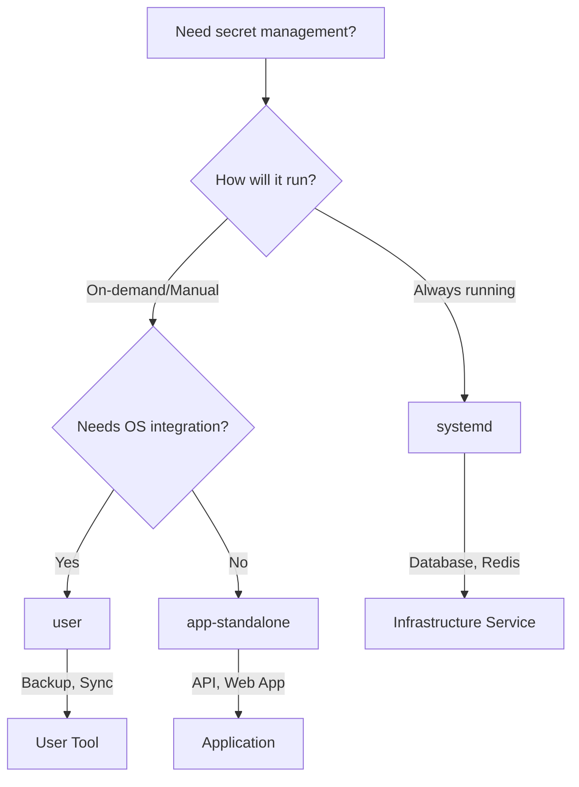

# SOPS-Nix Integration with Secret-First Framework

## 🔐 Secret-First Development Philosophy

This project implements a **Secret-First** approach where plaintext secrets cannot naturally occur in your development workflow. Instead of reactive measures, we provide proactive systems that prevent plaintext secrets from being committed.

### Core Principles
- **Age-only encryption**: No SSH fallbacks, pure Age-based encryption
- **Proactive prevention**: Git hooks and CI checks prevent plaintext commits
- **Zero-trust approach**: Every secret is encrypted from creation
- **Developer-friendly**: Clear error messages and automated fixes

### Quick Start with Secret-First

```bash
# 1. Initialize Secret-First environment
nix run .#secrets-init

# 2. Edit your secrets (always encrypted)
nix run .#secrets-edit

# 3. Enable git protection
pre-commit install

# 4. Develop safely - plaintext commits are impossible
git add . && git commit -m "secrets are automatically protected"
```

## 背景 / アーキテクチャの考え方
- 背景と設計方針は `BACKGROUND.md` に集約（責務分離・受信者選定・CI鍵運用など）。
- リンク: ./BACKGROUND.md
- 重要キーワード: 責務分離（OS とアプリの役割分離）、平文を derivation に埋めない、受信者は age を標準。

Production-ready templates with integrated Secret-First protection for your Nix projects.

## 🎯 Quick Template Selection



## 📁 Template Types

### 1. **app-standalone** - Independent Applications
- ✅ **No OS changes required**
- ✅ **nix run** executable
- ✅ **Docker/container ready**
- ✅ **CI/CD friendly**

**Use for:** Microservices, Web APIs, Development tools

```bash
# Quick start
nix run ./templates/app-standalone
```

### 2. **systemd** - System Services
- ✅ **Automatic startup**
- ✅ **systemctl management**
- ✅ **System-level integration**
- ✅ **Service supervision**

**Use for:** Databases, Message queues, Background workers

```bash
# Requires NixOS configuration change
services.my-service.enable = true;
```

### 3. **user** - User Tools
- ✅ **Available in PATH**
- ✅ **Optional scheduling**
- ✅ **User-level execution**
- ✅ **Manual or automated**

**Use for:** Backup scripts, Monitoring tools, Maintenance utilities

```bash
# After NixOS rebuild
user-script backup
```

## 🚀 Quick Start

### Step 1: Choose Your Template

```bash
# For independent apps (recommended for most cases)
cp -r templates/app-standalone/* my-app/

# For system services
cp -r templates/systemd/* my-service/

# For user tools
cp -r templates/user/* my-tool/
```

### Step 2: Set Up Secrets

```bash
# Generate age key (one-time)
age-keygen -o ~/.config/sops/age/keys.txt

# Create .sops.yaml in your project
cat > .sops.yaml << 'EOF'
creation_rules:
  - age: YOUR_PUBLIC_KEY_HERE
EOF

# Create and encrypt secrets
sops secrets/config.yaml  # Creates/edits encrypted file
```

### Step 3: Deploy

#### For app-standalone:
```bash
nix run              # Local execution
nix build .#container # Docker build
```

#### For systemd/user:
```nix
# Add to /etc/nixos/flake.nix inputs
my-app.url = "path:/path/to/my-app";

# Add to modules
my-app.nixosModules.default
```

## 📊 Template Comparison

| Feature | app-standalone | systemd | user |
|---------|---------------|------------|---------|
| **OS Changes** | ❌ None | ✅ Required | ✅ Required |
| **Startup** | Manual | Automatic | Manual/Timer |
| **Execution** | `nix run` | `systemctl` | Command |
| **Updates** | Instant | Rebuild | Rebuild |
| **Scaling** | ✅ Excellent | ⚠️ Limited | ⚠️ Limited |
| **Docker** | ✅ Built-in | ❌ N/A | ❌ N/A |
| **CI/CD** | ✅ Native | ⚠️ Complex | ⚠️ Complex |

## 🛡️ Secret-First Framework

The Secret-First framework provides comprehensive protection against plaintext secret commits through multiple layers of defense.

### 🚀 Secret-First Setup

```bash
# Step 1: Setup development environment
nix develop

# Step 2: Initialize Secret-First (idempotent)
nix run .#secrets-init
# Creates .sops.yaml, secrets/ directory, and initial encrypted secrets

# Step 3: Enable git protection
pre-commit install
# Installs hooks that block plaintext secrets from being committed

# Step 4: Verify protection is active
echo "secret: plaintext" > secrets/test.yaml
git add secrets/test.yaml && git commit -m "test"
# ❌ BLOCKED: Plaintext secrets detected
```

### 🔧 Secret-First Applications

#### secrets-init: Idempotent Initialization
```bash
# Standard setup (idempotent - safe to run multiple times)
nix run .#secrets-init

# Advanced modes
nix run .#secrets-init -- --dry-run                    # Preview changes
nix run .#secrets-init -- --force                      # Recreate existing files
nix run .#secrets-init -- --secret database.yaml      # Custom secret file
nix run .#secrets-init -- --help                       # Full options
```

#### secrets-edit: Protected Secret Editing
```bash
# Edit default secrets file
nix run .#secrets-edit

# Edit specific files
nix run .#secrets-edit -- database.yaml               # Edit existing file
nix run .#secrets-edit -- --create new-service.yaml  # Create new file
nix run .#secrets-edit -- --help                      # Full options
```

### 🛡️ Multi-Layer Protection

#### Layer 1: Pre-commit Hooks
Automatically installed hooks prevent plaintext commits:

```yaml
# .pre-commit-config.yaml
repos:
  - repo: local
    hooks:
      - id: secrets-plaintext-guard
        name: secrets plaintext guard
        entry: bash scripts/check-no-plaintext-secrets.sh
        language: system
        stages: [commit]
      - id: block-env-files
        name: block env files
        entry: bash -c 'echo "❌ Do not commit env.sh/.env*"; exit 1'
        files: '(^|/)(env\.sh|\.env(\..*)?)$'
        exclude: '(^|/)\.env\.example$'
```

#### Layer 2: Manual Verification
```bash
# Check for plaintext secrets manually
bash scripts/check-no-plaintext-secrets.sh

# Verbose mode with detailed reporting
bash scripts/check-no-plaintext-secrets.sh --verbose

# Check custom directory
bash scripts/check-no-plaintext-secrets.sh --dir /path/to/secrets
```

#### Layer 3: CI/CD Integration
```bash
# Nix flake check includes secrets verification
nix flake check
# Fails if plaintext secrets detected

# Direct CI integration
nix run nixpkgs#bash scripts/check-no-plaintext-secrets.sh
```

### 🔍 Detection Logic

The system detects encrypted files using dual validation:

1. **ENC[AES256_GCM] markers**: Direct SOPS encryption indicators
2. **SOPS+MAC validation**: Full SOPS file structure with MAC field verification

```bash
# Valid encrypted patterns:
api_key: ENC[AES256_GCM,data:xxxx,iv:yyyy,tag:zzzz,type:str]

# Or SOPS structure:
sops:
    kms: []
    gcp_kms: []
    age:
        - recipient: age1xxx
          enc: xxx
    mac: ENC[AES256_GCM,data:xxxx]  # MAC field required
api_key: ENC[AES256_GCM,data:yyyy]
```

### 🎯 Exclusion Patterns

#### Built-in Exclusions
- `*.example` files (templates)
- `*.bak`, `*.dec`, `*.tmp` (working files)
- `README.*` files (documentation)

#### Custom Exclusions
```bash
# .secrets-allowlist
secrets/test-data.yaml
secrets/*.fixture
docs/example-*.yaml

# Environment variable
SECRETS_CHECK_EXCLUDE="file1.yaml file2.yaml" git commit
```

### ⚙️ Configuration

#### Age Key Setup
```bash
# Generate age key (one-time setup)
mkdir -p ~/.config/sops/age
age-keygen -o ~/.config/sops/age/keys.txt

# Get public key for .sops.yaml
age-keygen -y ~/.config/sops/age/keys.txt
```

#### Development Modes
```bash
# Skip checks temporarily (local development only)
SKIP_SECRETS_CHECK=1 git commit -m "local development"

# Force mode (recreate all configuration)
nix run .#secrets-init -- --force

# Dry run mode (preview changes)
nix run .#secrets-init -- --dry-run
```

### 🚨 Error Resolution

When plaintext is detected:
```
❌ Found 2 file(s) with plaintext secrets:
  ❌ secrets/app.yaml
  ❌ secrets/database.yaml

TO FIX THESE ISSUES:
  1. Encrypt files with SOPS:
     sops -e -i secrets/app.yaml
     sops -e -i secrets/database.yaml

  2. Or add to .secrets-allowlist if they're test data:
     echo 'secrets/app.yaml' >> .secrets-allowlist
```

### 📊 Secret-First vs Traditional

| Aspect | Traditional | Secret-First |
|--------|-------------|--------------|
| **Default State** | Plaintext → Encrypt | Always Encrypted |
| **Protection** | Reactive (after mistake) | Proactive (prevents mistake) |
| **Developer Experience** | Manual encryption | Automated workflow |
| **Git Safety** | Relies on discipline | Technical enforcement |
| **CI Integration** | Optional add-on | Built-in validation |

## 🏗️ Architecture Principles

### Separation of Concerns

```
┌─────────────────────────────────────┐
│            OS Layer                  │
│  - Provides sops-nix capability     │
│  - Doesn't know app secrets         │
└─────────────────────────────────────┘
                  ↕️
┌─────────────────────────────────────┐
│         Application Layer           │
│  - Manages own secrets              │
│  - Self-contained deployment        │
└─────────────────────────────────────┘
```

### Scalability Comparison

```
Traditional (OS-integrated):
  /etc/nixos/configuration.nix grows with each app
  10 apps = 10 imports
  100 apps = 100 imports ❌

Modern (Standalone):
  Apps run independently
  10 apps = 0 OS changes
  100 apps = 0 OS changes ✅
```

## 🔒 Security Model

1. **Encryption at rest**: All secrets encrypted in git
2. **Runtime decryption**: Secrets decrypted only when needed
3. **Access control**: User/service-specific permissions
4. **Key management**: Age keys on deployment hosts only

## 🔑 Secret-First Encryption (Age-Only)

This framework uses **Age-only encryption** as part of the Secret-First philosophy. SSH fallbacks have been removed to ensure consistent, predictable behavior.

### Age Keys (Standard)
Age provides simple, secure encryption for all environments:

```bash
# Generate age key pair (one-time setup)
mkdir -p ~/.config/sops/age
age-keygen -o ~/.config/sops/age/keys.txt

# Get public key for configuration
age-keygen -y ~/.config/sops/age/keys.txt

# Secret-First automated configuration
nix run .#secrets-init
# Automatically creates .sops.yaml with current age key
```

### Manual .sops.yaml Configuration
If you need custom configuration:

```bash
cat > .sops.yaml << 'EOF'
# Secret-First SOPS configuration
creation_rules:
  - path_regex: secrets/.*\.(yaml|yml|json)$
    key_groups:
      - age:
          - age1... # Your public key here
EOF
```

### Why Age-Only?
- **Consistency**: Same encryption method across all environments
- **Simplicity**: No host-specific dependencies
- **Portability**: Works in containers, CI, and local development
- **Security**: Modern, audited encryption algorithm
- **Secret-First**: No fallback confusion or mixed configurations

## 📚 Documentation

Each template includes:
- Complete `flake.nix` implementation
- Detailed `README.md` with examples
- Sample `secrets/` structure
- `.sops.yaml` configuration

## 🧪 Testing

```bash
# Test all templates
./tests/test_templates.sh

# Test specific template
nix flake check ./templates/app-standalone
```

## 🛡️ Secret-First Protection (Built-in)

The Secret-First framework provides automatic protection through multiple layers:

### Automatic Git Protection
```bash
# Enable pre-commit framework (one-time setup)
pre-commit install

# Protection is now active - plaintext commits impossible
git add . && git commit -m "automatically protected"
```

### Manual Verification
```bash
# Check for plaintext secrets
bash scripts/check-no-plaintext-secrets.sh

# Verbose reporting
bash scripts/check-no-plaintext-secrets.sh --verbose

# Custom directory checking
bash scripts/check-no-plaintext-secrets.sh --dir /path/to/secrets
```

### CI/CD Integration
```bash
# Built into nix flake check
nix flake check

# Direct CI usage
nix run .#checks.secrets
```

The modern pre-commit framework replaces legacy git hooks and provides better integration with development tools.


## 🤝 Migration Guide

### From existing systemd-web-api example:
→ Use `templates/systemd/`

### From existing cli-tool example:
→ Use `templates/app-standalone/`

### From existing deploy-script example:
→ Use `templates/user/`

## 💡 Best Practices

1. **Start with app-standalone** unless you specifically need OS integration
2. **Use systemd** only for true infrastructure services
3. **Use user** for system administration tools
4. **Keep secrets minimal** - only what's absolutely necessary
5. **Rotate keys regularly** - age makes this easy

## 🆘 Troubleshooting

| Issue | Solution |
|-------|----------|
| "No age key found" | Run `age-keygen -o ~/.config/sops/age/keys.txt` |
| "Cannot decrypt" | Ensure correct age key and .sops.yaml match |
| "Command not found" | For user: run `nixos-rebuild switch` |
| "Service won't start" | Check `journalctl -u service-name` |

## 📦 Repository Structure

```
sops-flake/
├── templates/
│   ├── app-standalone/    # Independent apps
│   ├── systemd/        # System services
│   └── user/           # User tools
├── examples/              # Legacy examples (deprecated)
├── tests/                 # Test suite
└── docs/                  # Additional documentation
```

## 🚦 Status

- ✅ **app-standalone**: Production ready
- ✅ **systemd**: Production ready
- ✅ **user**: Production ready
- ⚠️ **examples/**: Legacy, use templates/ instead

## 📝 License

MIT - See LICENSE file for details
