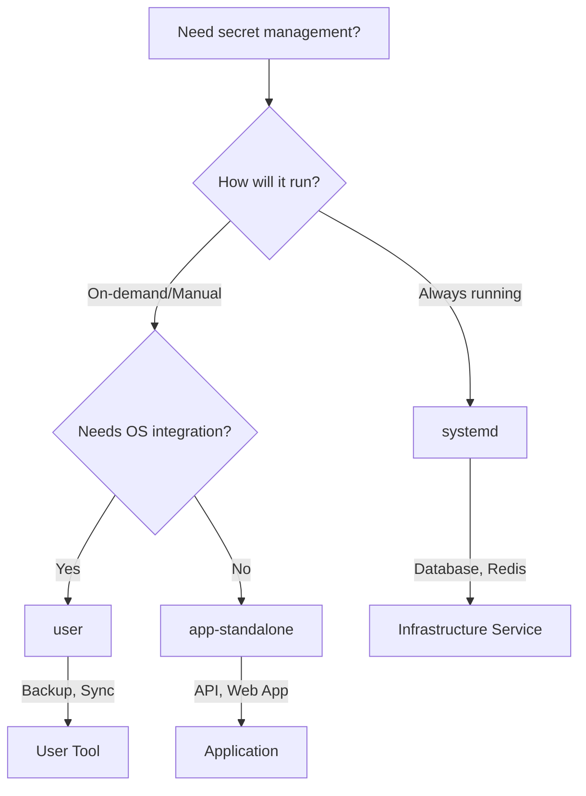

# SOPS-Nix Integration Templates

## 背景 / アーキテクチャの考え方
- 背景と設計方針は `BACKGROUND.md` に集約（責務分離・受信者選定・CI鍵運用など）。
- リンク: ./BACKGROUND.md
- 重要キーワード: 責務分離（OS とアプリの役割分離）、平文を derivation に埋めない、受信者は age を標準。

Production-ready templates for integrating sops-nix secret management into your Nix projects.

## 🎯 Quick Template Selection



## 📁 Template Types

### 1. **app-standalone** - Independent Applications
- ✅ **No OS changes required**
- ✅ **nix run** executable
- ✅ **Docker/container ready**
- ✅ **CI/CD friendly**

**Use for:** Microservices, Web APIs, Development tools

```bash
# Quick start
nix run ./templates/app-standalone
```

### 2. **systemd** - System Services
- ✅ **Automatic startup**
- ✅ **systemctl management**
- ✅ **System-level integration**
- ✅ **Service supervision**

**Use for:** Databases, Message queues, Background workers

```bash
# Requires NixOS configuration change
services.my-service.enable = true;
```

### 3. **user** - User Tools
- ✅ **Available in PATH**
- ✅ **Optional scheduling**
- ✅ **User-level execution**
- ✅ **Manual or automated**

**Use for:** Backup scripts, Monitoring tools, Maintenance utilities

```bash
# After NixOS rebuild
user-script backup
```

## 🚀 Quick Start

### Step 1: Choose Your Template

```bash
# For independent apps (recommended for most cases)
cp -r templates/app-standalone/* my-app/

# For system services
cp -r templates/systemd/* my-service/

# For user tools
cp -r templates/user/* my-tool/
```

### Step 2: Set Up Secrets

```bash
# Generate age key (one-time)
age-keygen -o ~/.config/sops/age/keys.txt

# Create .sops.yaml in your project
cat > .sops.yaml << 'EOF'
creation_rules:
  - age: YOUR_PUBLIC_KEY_HERE
EOF

# Create and encrypt secrets
sops secrets/config.yaml  # Creates/edits encrypted file
```

### Step 3: Deploy

#### For app-standalone:
```bash
nix run              # Local execution
nix build .#container # Docker build
```

#### For systemd/user:
```nix
# Add to /etc/nixos/flake.nix inputs
my-app.url = "path:/path/to/my-app";

# Add to modules
my-app.nixosModules.default
```

## 📊 Template Comparison

| Feature | app-standalone | systemd | user |
|---------|---------------|------------|---------|
| **OS Changes** | ❌ None | ✅ Required | ✅ Required |
| **Startup** | Manual | Automatic | Manual/Timer |
| **Execution** | `nix run` | `systemctl` | Command |
| **Updates** | Instant | Rebuild | Rebuild |
| **Scaling** | ✅ Excellent | ⚠️ Limited | ⚠️ Limited |
| **Docker** | ✅ Built-in | ❌ N/A | ❌ N/A |
| **CI/CD** | ✅ Native | ⚠️ Complex | ⚠️ Complex |

## 🏗️ Architecture Principles

### Separation of Concerns

```
┌─────────────────────────────────────┐
│            OS Layer                  │
│  - Provides sops-nix capability     │
│  - Doesn't know app secrets         │
└─────────────────────────────────────┘
                  ↕️
┌─────────────────────────────────────┐
│         Application Layer           │
│  - Manages own secrets              │
│  - Self-contained deployment        │
└─────────────────────────────────────┘
```

### Scalability Comparison

```
Traditional (OS-integrated):
  /etc/nixos/configuration.nix grows with each app
  10 apps = 10 imports
  100 apps = 100 imports ❌

Modern (Standalone):
  Apps run independently
  10 apps = 0 OS changes
  100 apps = 0 OS changes ✅
```

## 🔒 Security Model

1. **Encryption at rest**: All secrets encrypted in git
2. **Runtime decryption**: Secrets decrypted only when needed
3. **Access control**: User/service-specific permissions
4. **Key management**: Age keys on deployment hosts only

## 🔑 Encryption Methods

### Age Keys (Recommended Default)
Best for developers and CI environments:

```bash
# Generate age key pair
age-keygen -o ~/.config/sops/age/keys.txt
# Get public key
age-keygen -y ~/.config/sops/age/keys.txt

# Configure .sops.yaml
cat > .sops.yaml << 'EOF'
creation_rules:
  - path_regex: secrets/.*\.(yaml|json)$
    key_groups:
      - age:
          - age1... # Your public key here
EOF

# Encrypt secrets
sops -e -i secrets/app.yaml
```

### SSH Keys (Host-Specific Use)
Best for host-limited decryption:

```bash
# Use existing SSH host key
ssh-keygen -y -f /etc/ssh/ssh_host_ed25519_key > pubkey.txt

# Configure .sops.yaml for SSH
cat > .sops.yaml << 'EOF'
creation_rules:
  - path_regex: secrets/.*\.(yaml|json)$
    key_groups:
      - age:
          - ssh-ed25519 AAAAC3... # SSH public key
EOF

# Encrypt with SSH support (requires age-plugin-ssh)
export SOPS_AGE_KEY_FILE=~/.config/sops/age/keys.txt
sops -e -i secrets/app.yaml
```

### Usage Guidelines
- **Age**: Default choice for development, testing, and CI
- **SSH**: Use when secrets should only decrypt on specific hosts
- **Mixed**: Can combine both methods in .sops.yaml for different access levels

## 📚 Documentation

Each template includes:
- Complete `flake.nix` implementation
- Detailed `README.md` with examples
- Sample `secrets/` structure
- `.sops.yaml` configuration

## 🧪 Testing

```bash
# Test all templates
./tests/test_templates.sh

# Test specific template
nix flake check ./templates/app-standalone
```

## 🛡️ 平文コミット防止（推奨）

- ローカルフックの有効化（Gitフックをこのリポジトリ内に設定）
  - `git config core.hooksPath scripts/hooks`
  - 以後、コミット時に `scripts/hooks/pre-commit` が走り、`secrets/` 以下の未暗号化ファイルや `env.sh`/`.env` のコミットをブロックします。
- 手動チェック（フルスキャン）
  - `bash scripts/check-no-plaintext-secrets.sh`
- CIガード（GitHub Actions）
  - `.github/workflows/secrets-guard.yml` が `push`/`pull_request` で `scripts/check-no-plaintext-secrets.sh` を実行し、平文があると失敗します。


## 🤝 Migration Guide

### From existing systemd-web-api example:
→ Use `templates/systemd/`

### From existing cli-tool example:
→ Use `templates/app-standalone/`

### From existing deploy-script example:
→ Use `templates/user/`

## 💡 Best Practices

1. **Start with app-standalone** unless you specifically need OS integration
2. **Use systemd** only for true infrastructure services
3. **Use user** for system administration tools
4. **Keep secrets minimal** - only what's absolutely necessary
5. **Rotate keys regularly** - age makes this easy

## 🆘 Troubleshooting

| Issue | Solution |
|-------|----------|
| "No age key found" | Run `age-keygen -o ~/.config/sops/age/keys.txt` |
| "Cannot decrypt" | Ensure correct age key and .sops.yaml match |
| "Command not found" | For user: run `nixos-rebuild switch` |
| "Service won't start" | Check `journalctl -u service-name` |

## 📦 Repository Structure

```
sops-flake/
├── templates/
│   ├── app-standalone/    # Independent apps
│   ├── systemd/        # System services
│   └── user/           # User tools
├── examples/              # Legacy examples (deprecated)
├── tests/                 # Test suite
└── docs/                  # Additional documentation
```

## 🚦 Status

- ✅ **app-standalone**: Production ready
- ✅ **systemd**: Production ready
- ✅ **user**: Production ready
- ⚠️ **examples/**: Legacy, use templates/ instead

## 📝 License

MIT - See LICENSE file for details
