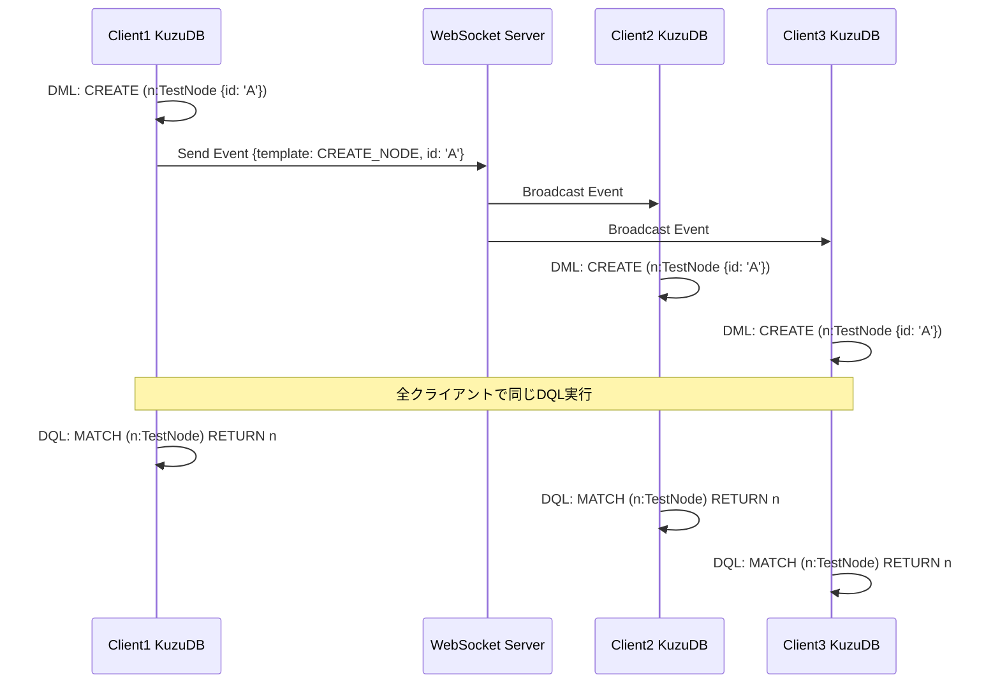

# 同期確認設計

## 同期の流れ



## 同期確認のためのDML/DQLパターン

### 1. 基本的なCREATE同期
```typescript
// Client1がDML実行
await client1.executeLocal(`CREATE (n:TestNode {id: 'node-1', value: 100})`);

// 同期待機後、全クライアントでDQL確認
for (const client of clients) {
  const result = await client.query(`
    MATCH (n:TestNode {id: 'node-1'}) 
    RETURN n.value as value
  `);
  assertEquals(result[0].value, 100);
}
```

### 2. UPDATE同期（Read-Modify-Write）
```typescript
// 初期状態作成
await client1.executeLocal(`CREATE (n:Counter {id: 'c1', value: 0})`);
await syncWait();

// 複数クライアントから同時UPDATE
await Promise.all([
  client1.executeLocal(`MATCH (n:Counter {id: 'c1'}) SET n.value = n.value + 1`),
  client2.executeLocal(`MATCH (n:Counter {id: 'c1'}) SET n.value = n.value + 1`),
  client3.executeLocal(`MATCH (n:Counter {id: 'c1'}) SET n.value = n.value + 1`)
]);

// 最終的な一貫性確認
await syncWait();
for (const client of clients) {
  const result = await client.query(`
    MATCH (n:Counter {id: 'c1'}) 
    RETURN n.value as value
  `);
  // イベントソーシングなので、最後のイベントが勝つ
  assertExists(result[0].value);
}
```

### 3. リレーション同期
```typescript
// ノードとリレーション作成
await client1.executeLocal(`
  CREATE (u1:User {id: 'user1'})
  CREATE (u2:User {id: 'user2'})
  CREATE (u1)-[:FOLLOWS]->(u2)
`);

await syncWait();

// 全クライアントでリレーション確認
for (const client of clients) {
  const result = await client.query(`
    MATCH (u1:User {id: 'user1'})-[:FOLLOWS]->(u2:User {id: 'user2'})
    RETURN count(*) as followCount
  `);
  assertEquals(result[0].followCount, 1);
}
```

### 4. 集計クエリによる同期確認
```typescript
// 複数クライアントから異なるノード作成
for (let i = 0; i < clients.length; i++) {
  await clients[i].executeLocal(`
    CREATE (n:TestNode {clientId: ${i}, timestamp: ${Date.now()}})
  `);
}

await syncWait();

// 全クライアントで同じ集計結果
for (const client of clients) {
  const result = await client.query(`
    MATCH (n:TestNode)
    RETURN count(n) as totalNodes,
           count(DISTINCT n.clientId) as uniqueClients
  `);
  assertEquals(result[0].totalNodes, clients.length);
  assertEquals(result[0].uniqueClients, clients.length);
}
```

## 重要な確認ポイント

1. **イベント順序性**: タイムスタンプ順でイベントが適用される
2. **冪等性**: 同じイベントを複数回適用しても結果が同じ
3. **最終的一貫性**: 全クライアントが最終的に同じ状態に収束