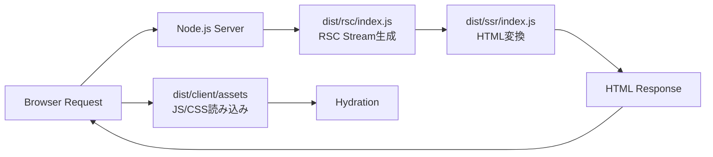

# Vite RSC デプロイメント構成

## ディレクトリ構成について

### Q: dist配下のディレクトリ構成はデフォルト？

**A: はい、これはVite RSCプラグインのデフォルト構成です。**

プラグイン内部で以下のデフォルト値が設定されています：
- `dist/client/` - Client環境のビルド出力
- `dist/rsc/` - RSC環境のビルド出力  
- `dist/ssr/` - SSR環境のビルド出力

カスタマイズしたい場合は、vite.config.tsで上書き可能：
```typescript
environments: {
  rsc: {
    build: {
      outDir: 'dist/custom-rsc', // カスタムディレクトリ
    }
  }
}
```

### Q: dist/{rsc,ssr}をサーバー側にデプロイする必要がある？

**A: はい、サーバー側に両方必要です。**

## デプロイ要件

### 📦 サーバー側に必要なもの
```
dist/
├── rsc/         ← サーバー必須
│   └── index.js (RSCハンドラー)
└── ssr/         ← サーバー必須
    └── index.js (SSRレンダラー)
```

### 🌐 CDN/静的ホスティングに配置
```
dist/
└── client/      ← 静的配信
    └── assets/
        ├── *.js
        └── *.css
```

## デプロイアーキテクチャ

### パターン1: Node.jsサーバー (推奨)
```
Node.jsサーバー
├── dist/rsc/    (RSC処理)
├── dist/ssr/    (HTML生成)
└── public/      
    └── assets/ → dist/client/assets/ (静的ファイル配信)
```

### パターン2: Edge Functions (Cloudflare Workers等)
```
Edge Function
├── dist/rsc/    (RSC処理)
├── dist/ssr/    (HTML生成)

CDN
└── dist/client/ (静的配信)
```

### パターン3: コンテナデプロイ
```dockerfile
# Dockerfile例
FROM node:22-alpine
WORKDIR /app

# サーバー側ファイル
COPY dist/rsc ./dist/rsc
COPY dist/ssr ./dist/ssr
COPY server.js ./

# クライアント静的ファイル
COPY dist/client ./public

EXPOSE 3000
CMD ["node", "server.js"]
```

## データフロー



## 実装例

### 1. Express.jsサーバー
```javascript
import express from 'express';
import { handler as rscHandler } from './dist/rsc/index.js';
import { handleSsr } from './dist/ssr/index.js';

const app = express();

// 静的ファイル配信
app.use('/assets', express.static('./dist/client/assets'));

// RSCエンドポイント
app.get('*.rsc', async (req, res) => {
  const response = await rscHandler(req);
  // RSC Streamを返す
});

// HTMLエンドポイント
app.get('*', async (req, res) => {
  const rscResponse = await rscHandler(req);
  const htmlStream = await handleSsr(rscResponse.body);
  // HTMLを返す
});
```

### 2. 環境変数設定
```bash
# .env.production
NODE_ENV=production
PORT=3000
RSC_ENCRYPTION_KEY=production-key-xxxxx
```

## チェックリスト

- [ ] `dist/rsc/` と `dist/ssr/` をサーバーにデプロイ
- [ ] `dist/client/` を静的ホスティング/CDNに配置
- [ ] サーバーから `/assets` パスで client アセットを配信
- [ ] RSCエンドポイント (`*.rsc`) の実装
- [ ] HTMLエンドポイントの実装
- [ ] 環境変数の設定（特に暗号化キー）

## 注意事項

1. **rscとssrは必ずサーバー側に必要**
   - 両方ともNode.js環境で実行される
   - クライアント側では動作しない

2. **clientディレクトリは静的配信可能**
   - CDNで配信することで高速化
   - ただしサーバーからの参照パスに注意

3. **暗号化キーの管理**
   - 本番環境では環境変数で管理
   - 開発と本番で異なるキーを使用