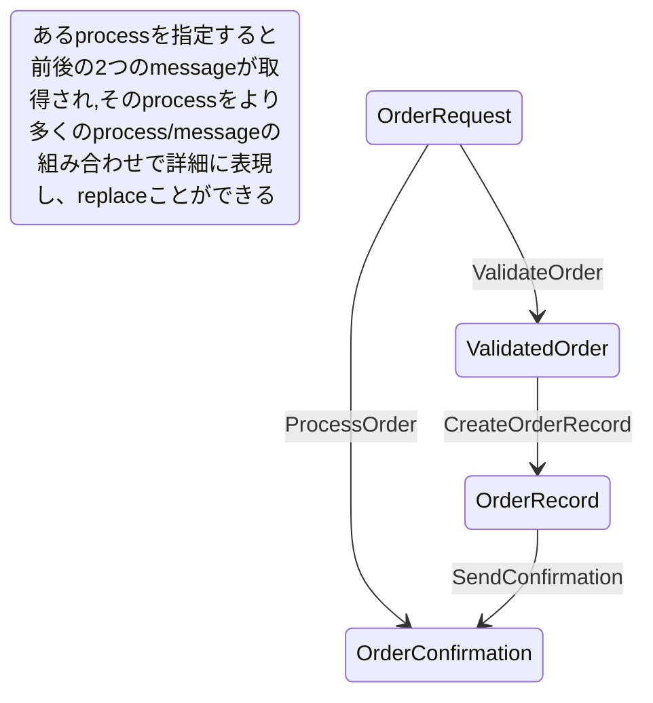

```mermaid
stateDiagram
    %% {
      detail_process: あるprocessを指定すると前後の2つのmessageが取得され,そのprocessをより多くのprocess/messageの組み合わせで詳細に表現し、replaceことができる
    %% }
    
    %% before
    %% stateDiagram
    %%     state OrderRequest
    %%     state OrderConfirmation
    %%     OrderRequest --> OrderConfirmation : ProcessOrder
    %% after
    %% stateDiagram
    %%     state OrderRequest
    %%     state ValidatedOrder
    %%     state OrderRecord
    %%     state OrderConfirmation
    %%     OrderRequest --> ValidatedOrder : ValidateOrder
    %%     ValidatedOrder --> OrderRecord : CreateOrderRecord
    %%     OrderRecord --> OrderConfirmation : SendConfirmation

    state OrderRequest
    state OrderConfirmation
    OrderRequest --> OrderConfirmation : ProcessOrder

    state ValidatedOrder
    state OrderRecord


    OrderRequest --> ValidatedOrder : ValidateOrder
    ValidatedOrder --> OrderRecord : CreateOrderRecord
    OrderRecord --> OrderConfirmation : SendConfirmation
```
