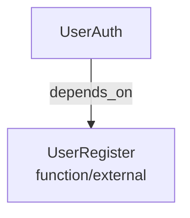

# 関数型スキーマジェネレーター

このプロジェクトは、関数型プログラミングのための強力なメタスキーマを生成するツールです。JSON Schemaベースの定義を使用して、関数の型、シグネチャ、特性などを詳細に記述できます。

## 概要

このツールは、関数型プログラミングにおける関数の特性（純粋性、評価戦略、カリー化など）を形式的に定義するためのスキーマを生成します。生成されたスキーマは、APIドキュメント、静的解析、型チェック、コード生成などの様々な用途に活用できます。

## 前提条件

- [Deno](https://deno.land/) (バージョン1.20以上)
- [Nix](https://nixos.org/) (オプション、シェルスクリプトを使用する場合)

## インストール

このプロジェクトはインストール不要で使用できます。リポジトリをクローンするだけです：

```bash
git clone https://github.com/yourusername/functional-schema-generator.git
cd functional-schema-generator
```

## エントリポイント

このプロジェクトは以下のエントリポイントを持っています：

1. **interface/cli.ts** - メインのコマンドラインインターフェース
   - 各種コマンドの動的ロードと実行
   - プラグイン型アーキテクチャ

## 使用方法

```bash
# スキーマ生成
./interface/cli.ts generate [オプション]

# 依存関係解析
./interface/cli.ts deps [スキーマパス] [オプション]

# スキーマとURI検証
./interface/cli.ts validate [ファイルパス] [オプション]

# ヘルプ表示
./interface/cli.ts help [コマンド名]
```

各コマンドの詳細は、ヘルプコマンドで確認できます：

```bash
./interface/cli.ts help generate
./interface/cli.ts help deps
./interface/cli.ts help validate
```

## スキーマ生成の例

基本的なスキーマを生成する：

```bash
./interface/cli.ts generate
```

カスタムオプションでスキーマを生成する：

```bash
./interface/cli.ts generate --output ./custom-schema.json --title "Custom Function Schema" --desc "A schema for custom functions"
```

## 依存関係解析の例

スキーマの依存関係をツリー形式で表示する：

```bash
./interface/cli.ts deps
```

依存関係をMermaid形式で出力する：

```bash
./interface/cli.ts deps --format mermaid --output deps.mmd
```

## 外部依存関係の検出と解析 (2025/04/06)

### 目的
関数スキーマ間の外部依存関係を検出して解析する機能を強化しました。これにより、複数の関数スキーマ（`*__Function.json`ファイル）間の依存関係を正確に把握し、視覚化できるようになりました。

### 機能概要
- `externalDependencies`配列に定義された関数間の依存関係を検出
- 依存関係グラフへの外部依存関係の正確な反映
- 依存関係解析の出力形式の拡充（JSON, DOT, Mermaid, CSVなど）
- 循環依存の検出と可視化

### 外部依存関係の定義方法

関数スキーマファイル内で外部依存関係を定義するには、ルートレベルに`externalDependencies`配列を追加します：

```json
{
  "title": "UserAuth",
  "type": "object",
  "externalDependencies": [
    {
      "$ref": "UserRegister__Function.json",
      "description": "ユーザー登録機能を利用して認証処理を行う"
    }
  ],
  "properties": {
    // 他のプロパティ...
  }
}
```

### 依存関係解析コマンドの使用方法

#### 基本的な使用法

```bash
# 特定のスキーマファイルの依存関係を解析
./interface/cli.ts deps UserAuth__Function.json

# 外部依存関係を含めた解析結果をJSONとして出力
./interface/cli.ts deps UserAuth__Function.json --format json --output deps-output.json
```

#### 出力形式のオプション

- `--format tree`: ツリー形式で表示（デフォルト）
- `--format json`: JSON形式で出力
- `--format dot`: GraphViz DOT形式で出力
- `--format mermaid`: Mermaid形式で出力
- `--format csv`: CSV形式で出力
- `--format text`: テキスト形式で出力

#### 詳細モード

詳細なログ出力を有効にするには `--verbose` オプションを使用します：

```bash
./interface/cli.ts deps UserAuth__Function.json --verbose
```

### 依存関係グラフの解釈

依存関係グラフには以下の要素が含まれます：

1. **ノード**: 関数や型を表す
   - 通常ノード: 内部依存関係
   - `external_dependency` ラベル付きノード: 外部依存関係

2. **エッジ**: 依存関係を表す
   - `depends_on`: 一般的な依存関係
   - `external_dependency`: 外部依存関係
   - `references`: 参照関係
   - `circular`: 循環参照（警告表示）

```bash
# グラフ構造の例（JSON形式）
{
  "nodes": [
    {
      "id": "UserAuth",
      "labels": ["UserAuth"],
      "properties": { "path": "", "description": "" }
    },
    {
      "id": "UserRegister",
      "labels": ["function/external"],
      "properties": { "path": "externalDependencies[0].$ref", "description": "" }
    }
  ],
  "edges": [
    {
      "id": "UserAuth_to_UserRegister",
      "source": "UserAuth",
      "target": "UserRegister",
      "label": "depends_on",
      "properties": {}
    }
  ]
}
```

### 可視化の例

Mermaid形式で出力して可視化する例：

```bash
# Mermaid形式で出力
./interface/cli.ts deps UserAuth__Function.json --format mermaid --output deps.mmd
```

生成されるMermaid形式の例：



### トラブルシューティング

**問題**: 外部依存関係が検出されない

**解決策**:
1. JSONスキーマのルートレベルに`externalDependencies`配列が正しく定義されているか確認
2. `$ref`フィールドが正確なファイル名（例: "UserRegister__Function.json"）を指定しているか確認
3. `--verbose`オプションを使用して詳細なログを確認

**問題**: 出力されたグラフに一部の依存関係が欠けている

**解決策**:
1. スキーマファイルの構造を確認し、すべての依存関係が正しく定義されているか確認
2. 循環依存関係がないか確認
3. より詳細な出力形式（JSON形式など）を使用して情報を確認

### E2Eテスト

外部依存関係の検出機能をテストするためのE2Eテストスクリプトが提供されています：

```bash
# E2Eテストの実行
nix shell nixpkgs#deno --command deno run --allow-read --allow-write --allow-run --no-check test/externalDependencyTest.ts
```

このテストでは、UserAuth__Function.json から UserRegister__Function.json への外部依存関係が正しく検出されるかを検証します。

## コマンドの拡張

新しいコマンドを追加するには、`./interface/cli/` ディレクトリに新しいコマンドファイルを作成します。コマンドファイルは標準のインターフェースに従い、自動的にCLIシステムに統合されます。

例えば、新しい `convert` コマンドを追加する場合：

1. `./interface/cli/convert.ts` ファイルを作成
2. 標準のコマンドインターフェースを実装
3. 実行権限を付与

これだけで、新しいコマンドがCLIシステムに追加されます。

## アーキテクチャ

このプロジェクトはクリーンアーキテクチャに基づいており、以下の層に分かれています：

- **インターフェース層** (`/interface`): ユーザーインターフェース（CLI、API、Web）
- **アプリケーション層** (`/application`): ユースケース、アプリケーションサービス
- **ドメイン層** (`/domain`): ビジネスロジック、エンティティ、値オブジェクト
- **インフラ層** (`/infrastructure`): 外部サービスとの統合、永続化

## フロントエンド

このプロジェクトには、関数型スキーマを視覚的に表示・操作するためのブラウザベースのフロントエンドが含まれています。

### ビルド方法

フロントエンドをビルドするには、以下のコマンドを実行します：

```bash
# nixpkgsを使用してビルド
chmod +x scripts/build.ts
./scripts/build.ts

# または直接Denoを使用
deno run --allow-read --allow-write --allow-run scripts/build.ts
```

ビルドが完了すると、`dist` ディレクトリに以下のファイルが生成されます：
- `index.html` - メインのHTMLファイル
- `browser.js` - TypeScriptからコンパイルされたJavaScriptファイル
- `styles.css` - スタイルシート

### 開発方法

フロントエンドの開発を行う際は、以下のワークフローを推奨します：

1. `interface/browser.ts` と関連ファイルを編集
2. `scripts/build.ts` を実行してコンパイル
3. ブラウザで `dist/index.html` を開いて動作確認

TypeScriptのコンパイルにはDenoを使用しています。nixpkgsを使用すると、必要な依存関係を自動的に取得できます。

### 機能

- ディレクトリツリー表示：スキーマファイルの階層表示
- 依存関係ビュー：関数間の依存関係を可視化
- コマンド実行：UIからコマンドを実行可能
- モバイル対応レスポンシブデザイン

## ライセンス

このプロジェクトはMITライセンスのもとで公開されています。詳細は[LICENSE](LICENSE)ファイルを参照してください。

## cli.tsリファクタリング (2025/04/03)

### 目的
CLIインターフェースの簡素化と拡張性の向上を目的としたリファクタリングを実施しました。複数のファイルに分散していたCLI関連機能を統合し、プラグイン型のアーキテクチャに再構築しました。

### 変更内容
1. **ファイル構成の変更**
   - ルートディレクトリの`cli.ts`を削除
   - `interface/cli.ts`をメインエントリポイントとして再構成
   - `interface/cli/`ディレクトリにコマンドごとのファイルを配置
   - 動的コマンドロード機能を実装

2. **実行方法の変更**
   ```
   # 旧実行方法
   ./cli.ts [オプション]
   
   # 新実行方法
   ./interface/cli.ts [コマンド] [オプション]
   ```

3. **拡張メカニズムの導入**
   - 新コマンドの追加は`./interface/cli/`ディレクトリにファイルを追加するだけ
   - 各コマンドが自身のヘルプ情報を保持
   - 標準化されたコマンドインターフェース

### 利点
- **コードの一貫性**: 標準インターフェースによる統一された実装
- **拡張性の向上**: ファイル追加だけで新機能を追加可能
- **保守性の向上**: 各コマンドが独立して管理可能
- **モジュール性**: 機能ごとの明確な分離
- **自己文書化**: コマンドが自身のヘルプ情報を管理

## CLI/ブラウザ共通化 (2025/04/05)

### 目的
CLI(コマンドライン)とブラウザ(Web)のインターフェースで共通処理を共有し、一貫性と保守性を向上させることを目的としました。

### 変更内容
1. **共通コンポーネントの分離**
   - `/interface/client/` ディレクトリを新設
   - 共通インターフェースや型定義を `types.ts` に集約
   - コマンド管理やヘルプ表示などの共通機能をモジュール化

2. **フロントエンド実装の刷新**
   - JavaScript実装から TypeScript 実装へ移行
   - `frontend` ディレクトリを `dist` ディレクトリに統合
   - ビルドスクリプトによるコンパイルプロセスの整備

3. **クライアント統合**
   - CLIとブラウザで同一のコマンド実行機能を共有
   - API通信クライアントを共通インターフェースに適合

### 利点
- **DRY原則の維持**: 重複コードの削減
- **一貫性の確保**: 同一機能の異なる実装による不整合を防止
- **開発効率の向上**: 機能追加時に複数の実装を変更する必要がない
- **型安全性**: TypeScriptによる型チェック
- **保守性の向上**: 共通モジュールの集中管理
