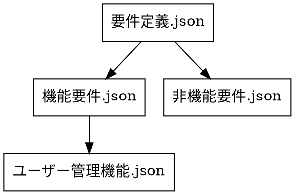

# JSONスキーマ依存関係解析ツール

このツールは、JSONスキーマファイル間の参照関係（`$ref`）を解析し、依存関係グラフを生成するためのライブラリおよびコマンドラインツールです。Deno環境とブラウザ環境の両方で動作します。

## 特徴

- JSONスキーマファイル間の依存関係を抽出
- ディレクトリの再帰的な探索に対応
- 複数の出力形式（JSON, テキスト, DOT, マークダウン）をサポート
- 相対パスと絶対パスの変換
- Denoとブラウザの両環境で動作可能
- モジュール化された設計

## ディレクトリ構造

```
/
├── cli.ts                 - コマンドラインインターフェース
├── main.ts                - ライブラリのメインエントリポイント
├── core/                  - 環境に依存しないコア機能
│   ├── types.ts           - 共通の型定義
│   ├── parser/            - JSON解析処理
│   │   └── schemaParser.ts - スキーマ解析のコア機能
│   ├── formatter/         - 結果のフォーマット機能
│   │   └── dependencyFormatter.ts - 依存関係グラフのフォーマット
│   └── output/            - 出力処理
│       └── outputHandler.ts - コンソール出力処理
│       └── outputFormatters.ts - 各種出力形式の実装
├── platform/              - プラットフォーム固有の実装
│   ├── deno/              - Deno向け実装
│   │   ├── index.ts       - Deno実装のエントリポイント
│   │   ├── fileSystem.ts  - ファイルシステム操作
│   │   └── pathUtils.ts   - パス操作ユーティリティ
│   └── browser/           - ブラウザ向け実装
│       ├── index.ts       - ブラウザ実装のエントリポイント
│       ├── fileSystem.ts  - ブラウザでのファイル操作
│       └── pathUtils.ts   - ブラウザでのパス操作
```

## インストール

Denoを使用する場合は、リポジトリをクローンするだけで使用できます：

```bash
git clone https://github.com/username/json-schema-analyzer.git
cd json-schema-analyzer
```

## 使用方法

### コマンドラインツールとして使用

```bash
# 基本的な使用法
./cli.ts /path/to/schemas

# オプションを指定して使用
./cli.ts --base-dir /path/to/schemas --root-schema root.json --format text

# ヘルプを表示
./cli.ts --help
```

#### オプション一覧

```
-d, --base-dir <dir>     スキーマファイルのベースディレクトリ
-r, --root-schema <file> ルートスキーマファイルの名前
-R, --recursive          ディレクトリを再帰的に探索する (デフォルト)
--no-recursive           再帰探索を無効にする
--relative-paths         相対パスを使用する (デフォルト)
--absolute-paths         絶対パスを使用する
-f, --format <format>    出力形式 (json, text, dot, tree, html, markdown)
--debug                  デバッグ情報を表示する
-h, --help               ヘルプメッセージを表示する
```

### ライブラリとして使用

#### Deno環境で使用

```typescript
// Deno環境でライブラリを使用する例
import { analyzeDependencies, denoImpl } from './main.ts';

async function main() {
  const dependencies = await analyzeDependencies(
    '/path/to/root-schema.json',  // スキーマパス
    denoFileSystem,               // ファイルシステム実装
    denoPathUtils,                // パスユーティリティ実装
    '/path/to/schemas'            // ベースディレクトリ
  );
  
  console.log(JSON.stringify(dependencies, null, 2));
}

main();
```

#### ブラウザ環境で使用

```html
<!-- index.html -->
<script type="module">
  import { analyzeDependencies, browserImpl, formatter } from './main.js';
  
  async function analyzeSchemas() {
    const dependencies = await analyzeDependencies(
      'schemas/root-schema.json',
      browserImpl.fetchFileSystem,
      browserImpl.pathUtils,
      'schemas'
    );
    
    // 結果を整形してDOMに表示
    const formattedResult = formatter.formatAsText(dependencies);
    document.getElementById('result').textContent = formattedResult;
  }
  
  document.getElementById('analyze-btn').addEventListener('click', analyzeSchemas);
</script>
```

## 出力形式

このツールは以下の出力形式をサポートしています：

### JSON形式

依存関係を JSON 形式で出力します：

```json
{
  "要件定義.json": [
    "機能要件.json",
    "非機能要件.json"
  ],
  "機能要件.json": [
    "ユーザー管理機能.json"
  ],
  "ユーザー管理機能.json": [],
  "非機能要件.json": []
}
```

### テキスト形式

依存関係をテキスト形式で出力します：

```
依存関係グラフ:
要件定義.json:
  → 機能要件.json
  → 非機能要件.json

機能要件.json:
  → ユーザー管理機能.json

ユーザー管理機能.json:
  依存なし

非機能要件.json:
  依存なし
```

### DOT形式

Graphviz用のDOT形式で出力します：



### マークダウン形式

JSONファイルのtitleとdescriptionフィールドを使用して階層構造のマークダウンを生成します：

```markdown
# 要件定義
システム要件定義のルート

## 機能要件
システムの機能要件に関する定義

### ユーザー管理機能
システムのユーザー管理機能に関する要件定義

## 非機能要件
システムの非機能要件に関する定義
```

## 技術的な詳細

- TypeScriptで実装
- JSON Schemaの`$ref`キーワードに基づく依存関係解析
- 関数型プログラミングスタイルの採用（クラスは未使用）
- 環境に依存しない設計
- パス操作やファイル操作を抽象化

## 機能拡張

このツールは、以下のような機能拡張が可能です：

1. **新しい出力形式の追加**：
   - `core/output/outputFormatters.ts`に新しい出力関数を追加

2. **新しいプラットフォームの対応**：
   - `platform/`ディレクトリに新しいプラットフォーム対応を追加

3. **UIの追加**：
   - ブラウザで動作する可視化ツールの構築

## ライセンス

MIT
