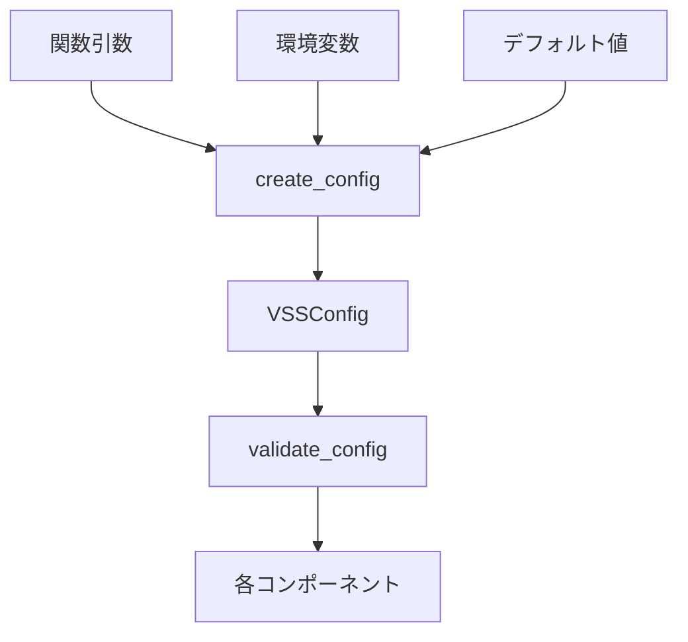

# 外部依存・外部入力の統合化提案

## 概要

VSS KuzuDBシステムにおける外部依存と外部入力の統合管理方法を提案します。この提案は、システムの設定可能性を高めながら、複雑性を最小限に抑えることを目的としています。

## 現在の外部依存

### 1. 必須の外部依存
- **KuzuDB**: グラフデータベースエンジン
- **VECTOR拡張**: ベクトル検索機能
- **sentence-transformers**: 埋め込み生成（オプショナル）

### 2. 外部入力ソース
- **環境変数**: システム全体の設定
- **関数引数**: 実行時のパラメータ
- **デフォルト値**: フォールバック設定

## 統合化アーキテクチャ

### 1. 階層的な設定管理

```
優先順位: 関数引数 > 環境変数 > デフォルト値
```

#### 実装済みの構造:
```
infrastructure/
  variables/
    env.py      # 環境変数の読み取りと検証
    config.py   # 設定の統合と優先順位処理
```

### 2. 設定の流れ



## 利用方法

### 1. 環境変数による設定

```bash
# データベース設定
export VSS_DB_PATH="/path/to/db"
export VSS_IN_MEMORY="false"

# モデル設定
export VSS_MODEL_NAME="cl-nagoya/ruri-v3-30m"
export VSS_EMBEDDING_DIMENSION="256"

# インデックス設定
export VSS_INDEX_MU="30"
export VSS_INDEX_ML="60"
export VSS_INDEX_METRIC="cosine"
export VSS_INDEX_EFC="200"

# 検索設定
export VSS_SEARCH_EFS="200"
```

### 2. プログラムからの利用

```python
from vss_kuzu.infrastructure.variables import create_config, validate_config

# 環境変数とデフォルト値を使用
config = create_config()

# 特定の値を上書き
config = create_config(
    db_path="./custom_db",
    index_mu=40,
    index_ml=80
)

# 設定の検証
is_valid, result = validate_config(config)
if not is_valid:
    # resultにはエラーの詳細が含まれる
    print("設定エラー:", result)
    # 例: {'embedding_dimension': '埋め込み次元数は正の整数である必要があります: -1'}
else:
    # resultには検証済みのconfigが含まれる
    validated_config = result
```

### 3. 既存設定の部分更新

```python
from vss_kuzu.infrastructure.variables import merge_config

# ベース設定を作成
base_config = create_config()

# 特定の値のみ更新
updated_config = merge_config(
    base_config,
    search_efs=300,
    index_metric="l2"
)
```

## 拡張ポイント

### 1. 設定ファイルのサポート

将来的には、YAML/JSONファイルからの設定読み込みをサポート可能：

```python
def load_config_from_file(file_path: str) -> Dict[str, Any]:
    """設定ファイルから設定を読み込む"""
    # 実装例
    with open(file_path) as f:
        if file_path.endswith('.yaml'):
            return yaml.safe_load(f)
        elif file_path.endswith('.json'):
            return json.load(f)
```

### 2. 動的な設定更新

実行時の設定変更をサポート：

```python
class ConfigManager:
    def __init__(self, initial_config: VSSConfig):
        self._config = initial_config
        self._callbacks = []
    
    def update_config(self, **updates):
        """設定を更新し、登録されたコールバックを実行"""
        self._config = merge_config(self._config, **updates)
        for callback in self._callbacks:
            callback(self._config)
```

### 3. 設定のシリアライズ

設定の保存と復元：

```python
def save_config(config: VSSConfig, file_path: str):
    """設定をファイルに保存"""
    config_dict = config_to_dict(config)
    with open(file_path, 'w') as f:
        json.dump(config_dict, f, indent=2)

def load_config(file_path: str) -> VSSConfig:
    """ファイルから設定を復元"""
    with open(file_path) as f:
        config_dict = json.load(f)
    return create_config(**config_dict)
```

## 利点

### 1. 明確な優先順位
- 関数引数 > 環境変数 > デフォルト値の順序が明確
- 設定のソース情報を追跡可能

### 2. 型安全性
- dataclassによる型定義
- 実行時の型検証

### 3. テスタビリティ
- 環境変数に依存しないテストが容易
- モック化が簡単

### 4. 拡張性
- 新しい設定ソースの追加が容易
- 既存コードへの影響を最小化

## 実装例

### アプリケーション層での利用

```python
from vss_kuzu.infrastructure.variables import create_config
from vss_kuzu.infrastructure import (
    DatabaseConfig,
    create_kuzu_database,
    create_kuzu_connection
)

def initialize_vss_system(db_path: Optional[str] = None):
    """VSSシステムを初期化"""
    # 設定を作成（引数、環境変数、デフォルト値を統合）
    config = create_config(db_path=db_path)
    
    # データベース設定を作成
    db_config = {
        'db_path': config.db_path,
        'in_memory': config.in_memory,
        'embedding_dimension': config.embedding_dimension
    }
    
    # データベースを作成
    success, database, error = create_kuzu_database(db_config)
    if not success:
        raise RuntimeError(f"Database creation failed: {error}")
    
    return database, config
```

## まとめ

この統合化アプローチにより：

1. **一貫性**: すべての外部入力が統一的に管理される
2. **柔軟性**: 様々な設定方法をサポート
3. **保守性**: 設定ロジックが一箇所に集約
4. **テスト容易性**: 外部依存のモック化が簡単

今後の拡張も容易に行えるアーキテクチャとなっています。